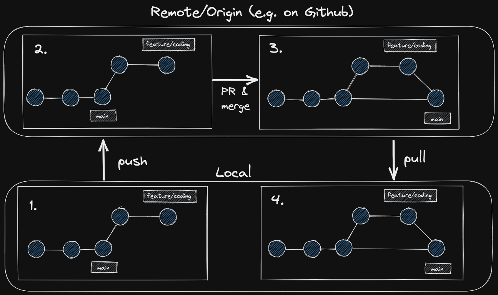
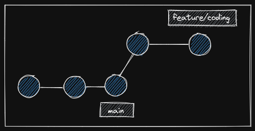

# Git Branches & PRs

## Learning Objectives

- Understanding what Git branches are and how to use them
- Learning what pull requests are and how to use them
- Understanding how branches and pull requests facilitate collaboration

## Requirements

- GitHub and Markdown
- Git CLI and Remote

## Demo

There is no pre-built demo for this session. You will build the demo from scratch during the session to demonstrate the Git feature branch workflow and pull request process.

---

## Session Guide

Working directly on the main branch can be risky, as it may introduce bugs into the production version of your application. To prevent this, a safe workflow is needed where features can be developed and tested without affecting the main version. This is where Git feature branches come in.

> Why is it important to use feature branches in Git, and how do pull requests help ensure code quality in a collaborative environment?

### Git Feature Branch Workflow

- Explain the need for a robust workflow that supports safe development practices.
- During the session, create a sketch of the Git feature branch workflow, starting with step 1 and finishing with step 4.   
  

### 1. Git Branches

- Highlight, that we can create different versions of our code in Git.
- Sketch how Git branches work:   

- Highlight, that creating a new branch does not copy the whole Git history, but creates just a new label for the current commit.
- Show how to create a new branch:

  - `git switch -c <branch name>`
  - `git switch <branch name>`

- Create some commits on the feature branch.
- Show how you can now switch between different versions of the code by switching branches.
- Highlight, that students can always create a test branch if they want to try out ideas in a save environment.

### 2. Git Push

- Show how to push the new feature to the remote repository.
- Highlight, that this is needed so that others can `review` the changes.
- `git push -u origin <feature branch name>`

### 3. Git Pull Requests

- Show, how a typical review process works.
- Explain, what a pull request is, how to write comments and view the differences introduced by the PR.
- Explain, what `merging` means and merge the PR.

### 4. Git Pull

- Show, that the feature is now included in the main branch.
- Tell the students, that the local main branch needs to be updated.
- Switch to the main branch on the local machine.
- `git pull` / `git pull -u origin main`
- Finish the excalidraw sketch and show once more the workflow steps.
