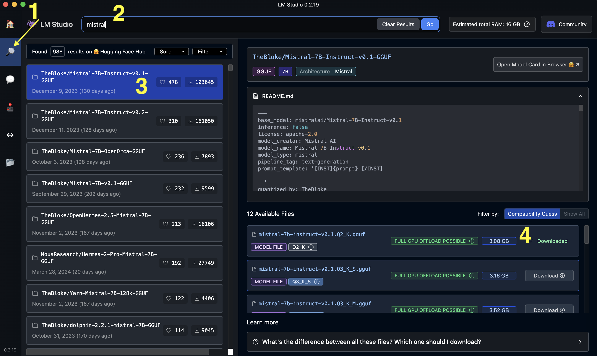
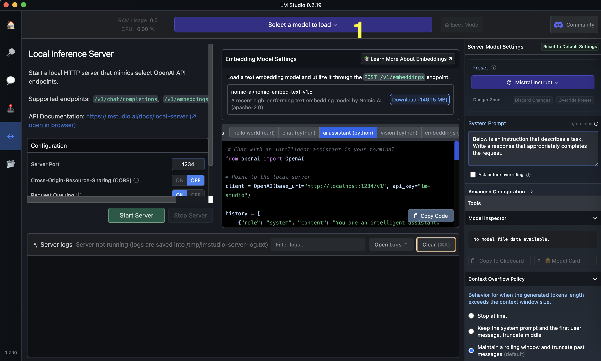
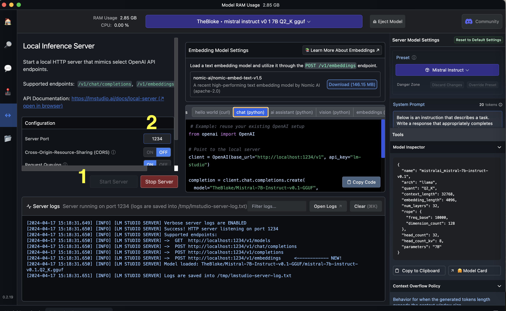

# LM Studio Setup

- Download [LM Studio](https://lmstudio.ai/)

- Search for, and download a model

- Run a local server using the model

Once the server is running, our nextjs API route should be able to talk to it via the openai npm package.

## What Are We Actually Doing Here?

### 1. **Utilizing LM Studio**

At its core, LM Studio allows us to download and run large language models (LLMs) on our own computers. This capability enables us to work with sophisticated models such as Mistral-7B right from our local environments.

### 2. **Configuring Local Servers**

Integration with your Next.js app means setting up a local server, LM Studio, that mimics the behavior of OpenAI's cloud services. This is done by modifying the base URL in your app’s configuration to point to your local setup instead of the internet-based servers.

### 3. **Working with Specific Models**

For example, the model file `mistral-7b-instruct-v0.1.Q2_K.gguf` represents the Mistral-7B model, which you can run locally using LM Studio.

### 3.5 **Different Levels of Model Quantization**

For this model, there are different bit quantization levels available. For demonstration purposes, we are using the lowest bit quantization level, but higher quantization would make the model more accurate. The tradeoff being you need to download a model that is a larger file size.

### 4. **Setting Up Your Environment**

It’s crucial to ensure that your local server, LM Studio, is prepared to receive and process API requests as expected by the OpenAI npm package.

### 5. **Exploring Additional Models**

If you’re interested in finding more models to experiment with, start by checking out repositories like Hugging Face or the LM Studio website. These platforms offer a variety of models along with their respective configuration files and guidelines on how to set them up for local development.
