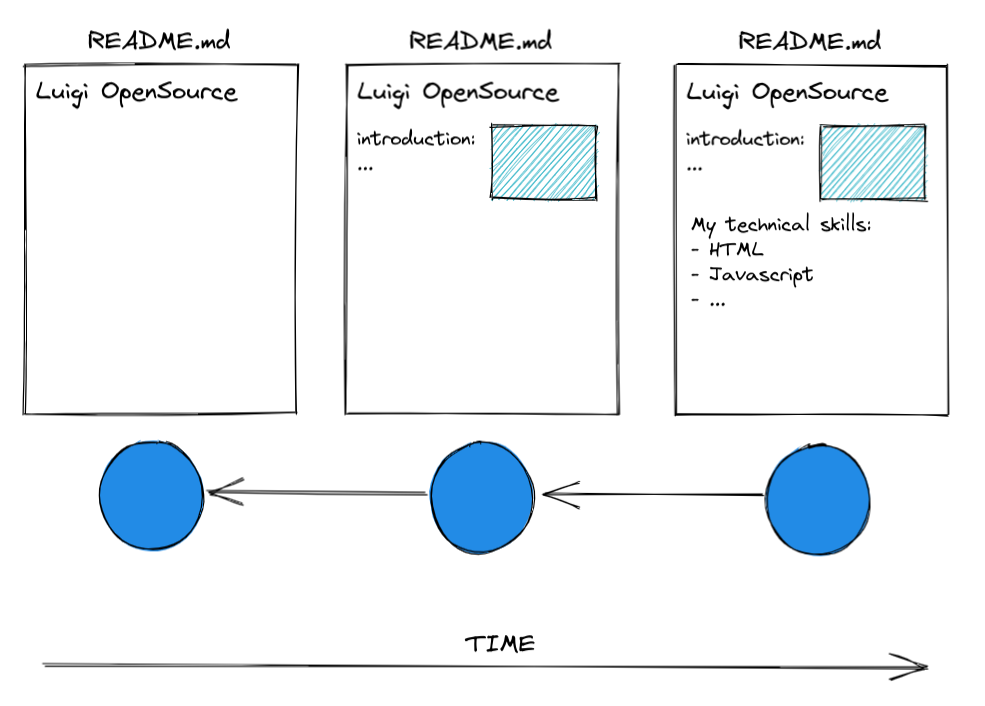

# GitHub & Markdown

> feel free to create a personal branch of this guide to add your own notes

## Learning objectives

- [ ] What is a VCS and why is it so useful / important
- [ ] Importance of GitHub in dev community
- [ ] Understanding what Markdown is / what it is used for
- [ ] How to write Markdown
- [ ] Creating repositories on GitHub
- [ ] Creating / editing files on GitHub
- [ ] Creating commits on GitHub

---

## Arrival: Motivate students and prepare them for the topic

> 💡 Breathe and relax :)

### Which important problem will we solve today?

- How to manage source code in a team. Importance of VCS:
  - How would you share code among team members without a VCS?
  - How would you "go back" to previous code versions (and serve previous software versions) when there is a bug in production?
  - TBD: Tell story about a software project gone terribly wrong because of the lack of a VCS

### Why is the content of todays block so important for the students?

- You are starting your professional developer career today. After today you will have your own presence & presentation on one of the the worlds biggest platforms for code sharing.
- Many companies use GitHub to get an overview about skills of a candidate

---

## Activate prior knowledge of students

- Ask questions:

  - Have you come into contact with a VCS before (and how / why)?
  - Can you think of anything where a VCS would have been helpful to you (e.g. writing an assay and accidently deleting parts of it)?
  - Show example of badly versioned text files:

  

---

## Inform: Sessionguide

### Git Workflow:

**1. Draw picture explaining Git Workflow (Commits only) like this one:**

> [Excalidraw link](https://excalidraw.com/#json=yDnqD1zakF2RAhdNcw7H_,UcR_F-8FYr8SwID2ugeHsg)

**2. Explain / draw use cases:**

- Go back to previous commit and continue work from there
- Fork someone elses repository and continue work from any commit

**3. Explain core principles / terminology:**

- [ ] `version control` : a system for managing multiple versions of software, content, websites or any other information. Any change in the given file(s) can be recalled later at any point. A version control system facilitates collaboration.
- [ ] `repository` : a centralized storage for a project with a record of all different versions (historisation).
- [ ] `commit` : a savepoint marking a milestone in a project that can be returned to at any time. It's a snapshot of the current changes. The sum of all commits define the history of a project or file.
- [ ] `hash` : a unique identifier of a commit.
- [ ] `git` : softwate that enables developers to create commits and a history of their projects
- [ ] `GitHub` : platform to collaborate on projects and share code.
- [ ] `difference of git and GitHub` : git is the software that runs on your own computer and executes the version control. It sends the information of your current changes to the platform GitHub where you are able to share it with your team or the world.

**4. Show briefly on GitHub how to create a repository.**

- [ ] Create a repository `my-first-repository`. (Uncheck "Add a README file"!)
- [ ] Create a README.md file and create the first commit.
- [ ] Add content (todo-list, recipe, ...) and create a commit for every step.

Example text:
My first day on GitHub
Today I learned that version control is an essential part of my career as web developer. Some keyword that I should remember for later are: git, GitHub, version controll, repository, commit and hash.
The next 3 months will be a very exciting time, as I will learn new things every day.

### Markdown:

**1. Show the preview of your file and demostrate the lack of formatting** (Übersichtlichkeit)

**2. Explain what Markdown is:**

- [ ] Markdown is a lightweight markup language for formatting text, which is created like this: "xxx.md"
- [ ] It has a specific syntax, but also HTML syntax can be used in Markdown files.

**3. Add Markdown syntax to your README.md file**

- [ ] Add "#" in front of the headline "My first day on GitHub"
- [ ] Highlight the words "essential part" as **bold** text
- [ ] Add an unordered list for the keywords
- [ ] Add a
  > blockquote for the last phrase
- [ ] Add an example image link this:
      
- [ ] Feel free to show any other markdown syntax. You can find an overview [here](https://www.markdownguide.org/cheat-sheet/) or [here](https://github.com/adam-p/markdown-here/wiki/Markdown-Cheatsheet#emphasis)

---

## Process

### Project / Assignment

---

## Evaluate

> 💡 Don't forget to highlight the progress of today :)

### Recap of the Project/Assignment and Discussion of MVP / Solution

-
-

## Keywords for Recap:

-
