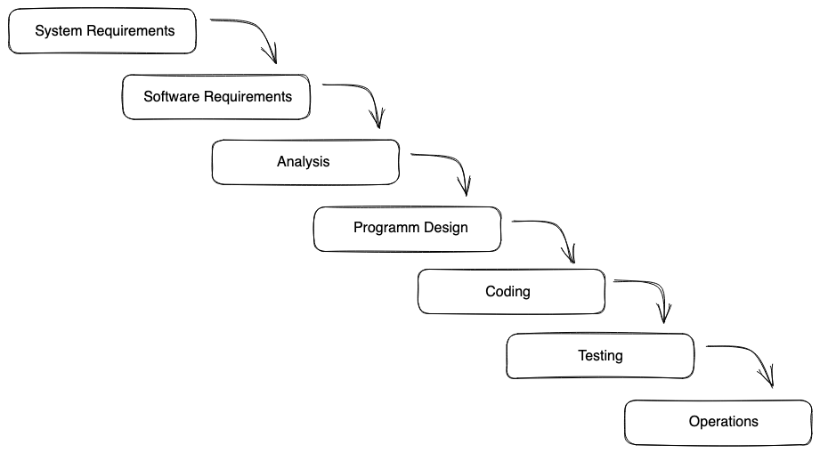
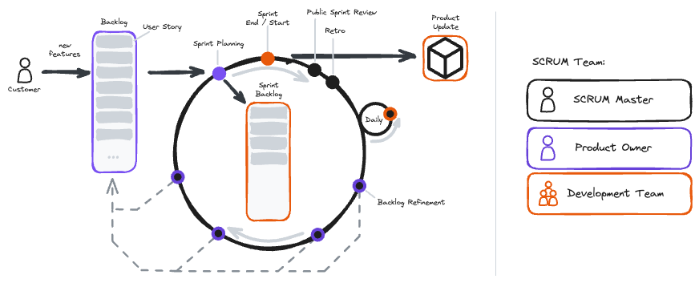

# Agile Workflow and User Stories

> Please make sure to give the students all necessary information and workshops:
>
> - Capstone Forum (speak about Capstone ideas)
> - Agile workshop (external)
> - Agile and Scrum Session (this one)
> - Write and publicly review user stories with your students (part of the challenge)
> - [How to capstone](../../extra-sessions/how-to-capstone/) Slides and Slack massage
> - Show how to build a Project Board in Github and use it for Kanban during capstone

## Learning objectives

- What a MVP is
- How to organize your backlog
- What are the Scrum meetings?
- How to write good user stories

> ❗️ Check the [Scrum Intro](./Scrum-intro.md) for more infromation about agile and Scrum.
> Explain the content in detail, if there is **no** external workshop.

---

How to organize a team in Software Development using agile / Scrum.

### Why is the content of today's block that important for the students?

- it's state of the art project management
- you most likely will face it in your next job
- understanding the process makes development easier

### Required

- user stories

---

## Session Guide

In this workshop, students will explore how their future workflow in a team will look like. Given the considerable departure from traditional practices, it's crucial for them to grasp the fundamental reasons behind the shift.

You can use this [excalidraw file](./assets/agile-workflow.excalidraw) as a visual guide through the session.

### A New Workflow for a New Industry

- Briefly outline the conventional waterfall workflow, typical in classical engineering:
  
- Emphasize its necessity in scenarios:
- Involving the design of complex, error-intolerant machinery.
- Where system requirements remain static (e.g. aircraft design).
- Requiring costly updates or fixes (e.g. Tesla's large-scale vehicle recall).
- Explain that in software development these assumptions often don't apply:
- Software errors seldom have the same consequences than a failing machine.
- The rapid evolution of computing and software demands constant adaptation.
- Updating software is simple and cheap compared to other industries.
- Consequently, in software development a more "agile" workflow with fast product cycles is not only possible but required.

### Agile Concepts

- Outline the key principles of agile workflows:
- Agile teams operate in short development cycles (2-4 weeks).
- Teams are self-organized and interdisciplinary, fostering faster development.
- Product evolution occurs incrementally rather than in a single plan.
- Users receive updates with the latest features after each cycle.
- Emphasize the adaptability of the product to changing requirements due to the short development cycles.
- Highlight the cost-effectiveness and innovative potential enabled by this workflow.
- Note the existence of various workflows embodying these principles, with our focus on SCRUM for this session.

### SCRUM Overview

- Provide an overview of SCRUM using the following sketch:
  
- Emphasize that SCRUM serves as a **framework** for agile product development, consisting of the following components:
- **User Story**: Each product feature is planned as an independent unit known as a User Story.
- **Backlog**: Future User Stories are stored in a constantly evolving list called the Backlog, responsive to changing requirements.
- **Sprint**: Teams operate in short development cycles called sprints.
- **Sprint Backlog**: Each sprint comprises a detailed, prioritized list of User Stories called the Sprint Backlog, which is fixed once the sprint begins.
- Introduce the roles within a SCRUM team:
- **SCRUM Master**: Facilitates team meetings and ensures a smooth SCRUM process.
- **Product Owner**: Manages User Stories and the Backlog, maintaining close communication with the customer to update requirements.
- **Development Team**: Comprises all individuals actively contributing to the product, including designers, frontend and backend developers, and DevOps engineers.
- Explain the key events during a SCRUM sprint:
- **Daily Stand-up**: Daily brief meetings where team members update each other on their tasks.
- **Backlog Refinement**: Regular meetings between the development team and the product owner to discuss upcoming User Stories and refine priorities.
- **Sprint Planning**: Pre-sprint meeting to select and finalize User Stories for the upcoming sprint, transitioning them to the new Sprint Backlog.
- **Public Sprint Review**: Post-sprint review session where updates are showcased to other teams and stakeholders, providing insight into recent changes and future plans.
- **Retrospective (Retro)**: Optional meeting for internal reflection on the previous sprint, aimed at improving processes for future sprints.

### A Developer's Week

- Illustrate a typical week for a developer within this framework:

As part of a diverse team with various expertise, developers engage in multiple events throughout the week to ensure effective collaboration and information sharing. While ideally comprising 10-15% of the week, meeting time may vary based on team dynamics.


### User Story

- User stories define expected user value for our product, guiding the team in defining requirements and tasks.
- Recap that students have previously engaged with user stories in recap projects.
- Present an example to the students:

```
Title: List of Jokes

Value Proposition:

- As a user,
- I want to view a list of jokes
- in order to decide which one is funny.

Description:

- Scribble an app with a list of jokes.
- Make sure you scribble "real" proportions.

Acceptance Criteria:

- List scrolls vertically.
- Displays a list of joke cards.
- Each card contains a joke.
- Includes a persistent heading at the top.

Tasks:

- Create a feature branch.
- Generate dummy data.
- If it's the first user story: Implement global styles.
- Develop the JokeCard Component.
- Implement a prop for joke data.
- Utilize mapping over dummy data to generate JokeCard instances.
- Add the heading as an h1 tag.
- Implement fixed positioning for the heading.
```

- Explain the components of a user story:
- **Title**
- Concise and specific.
- **Value Proposition**
- Identifies a user need without prescribing a solution.
- **Description**
- Presents a design or text with precision and clarity.
- Avoids unnecessary information.
- **Acceptance Criteria**
- Describes every new element of the feature in detail.
- Addresses potential behaviors, such as empty entries or alert text.
- Specifies every functionality like user interaction or automatic events like data fetching.
- **Tasks**
- Lists actionable items for the development team.
- Geared towards developers, outlining necessary actions for implementation.

### MVP

- Explain **Minimum Viable Product (MVP)**
- An MVP is a product designed to sufficiently address the user's core problem, featuring only essential functionalities.
- By swiftly gathering feedback from users/customers, the team can implement changes before they become costly.
- Early feedback facilitates early learning about user needs.
- It's compact, focusing solely on the essential elements of the app.

The MVP serves as a risk mitigation tool throughout product development, offering a functional product with minimal features, created and utilized to gather customer or user feedback.

- Highlight, that it is the goal of an agile team to rapidly create an MVP in order to get as much feedback on the product as soon as possible.

---
