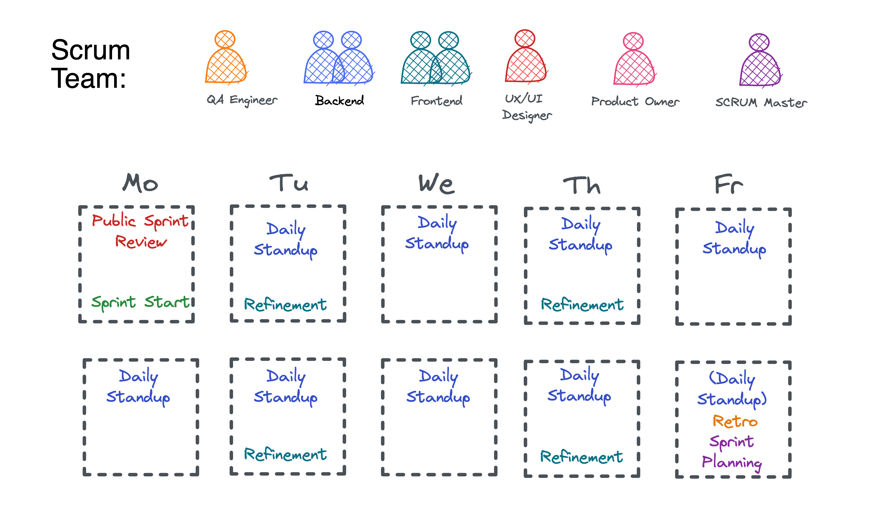
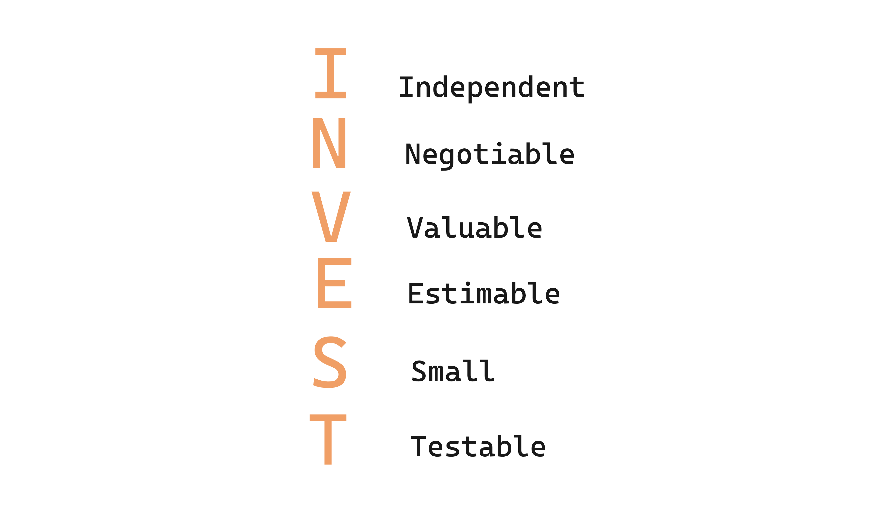
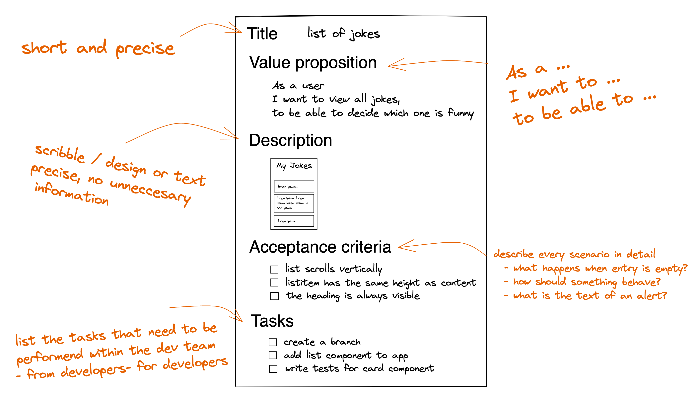

# Agile Workflow and User Stories

> 💡 Feel free to create a personal branch of this guide to add your own notes

Recommended schedule for this session:

| duration | content         |
| -------- | --------------- |
| 0:45     | Session         |
| 1:00     | Active Learning |
| 1:00     | Recap           |

> Please make sure to give the students all necessary information and workshops:
>
> - Capstone Forum (speak about Capstone ideas)
> - Agile workshop (external)
> - Agile and Scrum Session (this one)
> - Write and publicly review user stories with your students (part of the challenge)
> - [How to capstone](../../extra-sessions/how-to-capstone/) Slides and Slack massage
> - Show how to build a Project Board in Github and use it for Kanban during capstone

## Learning objectives

- [ ] What a MVP is
- [ ] How to organize your backlog
- [ ] What are the Scrum meetings?
- [ ] How to write good user stories

> ❗️ Check the [Scrum Intro](./Scrum-intro.md) for more infromation about agile and Scrum.
> Explain the content in detail, if there is **no** external workshop.

---

### Which important problem will we solve today?

How to organize a team in Software Development using agile / Scrum.

### Why is the content of today's block that important for the students?

- it's state of the art project management
- you most likely will face it in your next job
- understanding the process makes development easier

### Which previously learned concepts will be utilized in this session?

- user stories

---

## Information for Slides: Session Guide

- start slides with `npm run start` and on your localhost navigate to folder `agile&ScrumSlides`.

> ❗ If students already had the **external Agile Workshop,** the SCRUM Intro: Slides are only needed for a quick recap of the agile content:
> ask students to recap. Show the slides and let them explain

### SCRUM Intro: Slides

> ❗️ Check the [Scrum Intro](./Scrum-intro.md) for more infromation about agile and Scrum.
> Explain the content in detail, if there is **no** external workshop.

- What is agile
- "we are agile"
- SCRUM
- Classic waterfall model

### MVP

- [ ] explain **minimum viable product**

Because the agile methodology is built on validating and iterating products based on user input, the MVP plays a central role in agile development.

- [ ] It is a product, that is good enough to solve the core problem of the user, and only has functions for that.
- [ ] The team gets feedback from users/costumers fast and can adopt changes before it gets expensive.
- [ ] Early feedback means learning early about needs.
- [ ] It's small. What matters is the very core of your app.

> In most cases it is a display of information the user provides or receives from somewhere, processed in a way that meets the needs of the user.


The MVP is an instrument for risk minimization in the course of product development.
It's a serviceable product with minimal features, created effortlessly and used to obtain customer or user feedback


### Backlog

- [ ] talk about backlogs

There are two backlocks to consider: Product Backlog and Sprint backlog.

- [ ] **Product Backlog**: The Product Owner owns the product backlog. There are items listed, that need to be considered during development of the product. It is prioritized, and contains user stories, anybody can contribute. The Product Owner keeps track and knows which items need to be done soon. The priorities and content are always open for changes.

- [ ] **Sprint Backlog**: The sprint backlog defines all user stories for the next sprint. The user stories are detailed and finished, prioritized and fix. Once the sprint started, the sprint backlog is protected and the development team works concentrated on those tasks.


In scrum, the dev team has refinement events regularly during the week, to develop new user stories in the product backlog. In sprint planning events, the next sprint will be discussed and prioritized. Once the sprint has started, it is protected and can not be changed.

> show the SCRUM page again if you want to show it

### A developer's week (example)

- [ ] explain very short a week of a developer.

Your team is diverse and has different professions and knowledge.
To gather all information and keep everyone involved in the process, the scrum team has a lot of events to join. This is necessary to enable everyone to do their job properly. The meeting time should be 10-15% of your week, but often increases, depending on teams.



### User story

Defining a expected user value for our product, **user stories** allows us to define requirements and tasks to be followed by the team.

- [ ] Goal: You need a reason for the user, why he/she might need the feature. The reason shall never be 'because its possible.

The structure is fix:

```
**Value proposition**

- As a User ... (User, Author, logged in User...)
- I want to ...
- in order to ...
```

- [ ] make examples:

```
As a user,
I want to view all Jokes,
to decide which one is funny.
```

```
As a user,
I want to add a joke to this list,
to remember jokes I just learned.

```

```
As an mobile bank customer,
I want to see balance on my accounts,
So that I can make better informed decisions about my spending
```

To write good user stories, make sure that it fits certain criteria.

A good user story will follow the criteria termed as INVEST by _Bill Wake_.

### How good are our user stories?



- [ ] I: Independent

User stories should be independent. You have to ensure that any changes to a user story do not affect another. This is to avoid increasing the work burden and an effort to keep user stories simple.

- [ ] N: Negotiable

One of the main purposes of creating user stories is to give your team flexibility in their working process. Hence, the project team must be given free reign in the implementation of user stories

- [ ] V: Valuable

A user story that fails to clearly state the value of the product to the user is essentially worthless. While creating user stories, you must make it understandable and also clearly state the value of the product.

- [ ] E: Estimable

The development of the goals highlighted by the user story should be measurable. This will allow your team to determine their priorities as well as their working schedule.

- [ ] S: Small

User stories need to be short. Stories that require multiple sprints to be completed defeat the purpose of what a user story needs to achieve.

- [ ] T: Testable

Finally, the user story needs to have an achievable goal that can be tested to see if it delivers on user expectations.

### Write a full user story

The structure is fixed!

- Title
  - Short and precise
- Value proposition
  - As a User... (User, Author, logged in User...)
  - I want to...
  - in order to ...
- Description
  - Scribble / design or text
  - Precise, no unnecessary information
- Acceptance criteria
  - Describe every scenario in detail
    - What happens when an entry is empty?
    - How should something behave?
    - What is the text of an alert?
    - List is scrollable...etc
- Tasks
  - List the tasks that need to be performed within the dev team
  - From developers - for developers:
    - Checkbox, try to sort it as you work on it
    - List Components
    - Storybook
    - Tests
    - Add to app
    - Global styles



Further knowledge:

- [ ] User stories should be as slim as possible.
- [ ] Whenever you can remove something - do it and write another user story.
- [ ] We don't want to estimate complexity (or even hours or duration, also no story points).
- [ ] When you discuss a user story in your team, try to verbalize every detail. Expectations are different in persons minds.

> Create an example in Excalidraw
>
> Make your own or use the following:

```
Title : List of jokes

Value proposition

- As a User user
- I want to view a list of jokes
- in order to decide which one is funny

Description

- Scribble an app with a list of jokes.
- Make sure you scribble "real" proportions.

Acceptance criteria

- [ ] List scrolls vertically
- [ ] Listitem height is as high as content
- [ ] The heading is always visible

Tasks

- [ ] Create branch
- [ ] Write tests
- [ ] Update Storybook
- [ ] Generate dummy-data
- [ ] If it's the first user story: Global styles
```

> feel free to make another example

---

## Process: Challenges

- [ ] Provide the [handout](agile-workflow-and-user-stories.md) and the
      [challenges](challenges-agile-workflow-and-user-stories.md) to the students
- [ ] Open the handout and walk the students through the tasks
- [ ] Divide the students into groups of \_\_\_
- [ ] Remind them of the ground rules:
  - Meet again 30 minutes before lunch break in the class room.
  - They can ask the coaches for help at any time.
  - Always try to help each other.
  - Take a break within the next 1.5 hours.
  - Keep an eye on Slack.

---

## Evaluate: Recap of the assignment / Discussion of the MVP / Solution

- Revisit the question that was posed in the beginning of the session and try to answer it with a
  few phrases.

---

## Checkout

> 💡 In case the students seem frustrated try to find some encouraging words (e.g. remind them of
> how far they have come already) :)

- [ ] Summarize the day by repeating all of the topics that were discussed
- [ ] Highlight the progress made that day
- [ ] Encourage the students to repeat what they learned with practical exercises
- [ ] Remind them to rest :)

## Keywords for Recap:

agile, user stories, SCRUM, Sprint, Backlog, MVP, waterfall model, Kanban

> These keywords are for the weekly summary on Fridays. We use the keywords to automatically
> generate excalidraw tags with the help of
> [this amazing tool](https://github.com/F-Kirchhoff/tag-cloud-generator). The students structure
> the cards in a pattern that makes sense for them. Each tag, that is added to the structure needs
> to be explained in a few words by one student. We go in rounds one by one until all tags are
> included in the structure.
