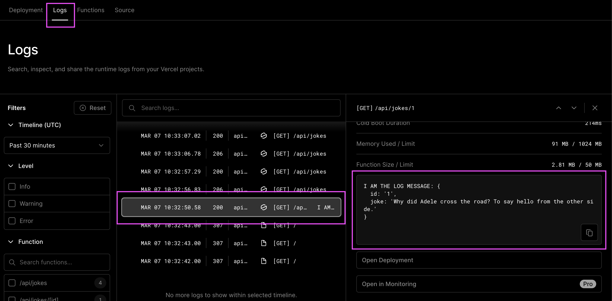

# Backend API Routes

## Learning Objectives

- [ ] knowing what serverless functions are
- [ ] understanding what a server-side API is meant for
- [ ] knowing how to implement Next.js API routes
  - [ ] static API routes
  - [ ] dynamic API routes
- [ ] knowing how to debug API routes with `console.log()`

---

## Serverless functions

There are different approaches to creating backend functions for web applications.

A traditional web server for example built with the Node.js framework Express is a program running on a server or virtual machine that listens for incoming HTTP requests - like a waiter at a restaurant waiting for customers to place their orders. The code for the Express server is typically written in a so called monolithic structure, where all the different functions and endpoints are managed by the same program.

On the other hand Serverless Functions are like little helpers that are only executed on-demand, i.e. when they are needed. They wait for specific things to happen, like when a web applications gets a HTTP request or when a database gets updated. When that happens, the serverless function runs its code to do the specific job it was programmed to do and is terminated afterwards.
Serverless cloud provider, like Vercel, take care of all the details like setting up the computer resources needed to run the code and shutting them down when the job is done. It's like having a team of chefs come into the kitchen, cook a dish, and then clean everything up when they are finished. This makes it easier for developers to write code without having to worry about managing servers or resources.

> 💡 This is a very basic explanation. If you're interested in learning more about
> Vercel Serverless Functions, you can read about it [here](https://vercel.com/docs/concepts/functions/serverless-functions)

---

## What a server-side API is meant for

As we already learned in the JS Fetch session an API (Application Programming Interface) can be seen from different perspectives and occur on various levels.

APIs running on a server environment are called server-side APIs. They are provided by a _server_, opposing to the APIs provided by the browser (which is also called the _client_). A common use-case for such server-side APIs is to create, read, update and delete data; so called CRUD operations.

> 💡 Take a look at handout of the JS Fetch Session to refresh your knowledge of APIs.

---

## Next.js API routes

Our main goal is to build a database and to handle its data in our web application. To do this we have to create our own API routes inside of the web application and decide what information and data the routes return. Luckyly, Next.js provides us with a cool feature using simple and intuitive syntax.

It follows a simple folder structure: Any file inside the folder e.g. `pages/api/test/file.js` is mapped to the respective url with the same path e.g. `/api/test/file` and will be treated as an API endpoint instead of a page.

In Next.js, an API route is simply a JavaScript module that exports a default function. For example, a file called `pages/api/hello.js` creates the API endpoint `/api/hello` that responds with a JSON message of "Hello neuefische!". The handler function takes two arguments: a request object and a response object, which are used to start the serverless programm on vercel and handle incoming requests and send responses back to the client.

```js
export default function handler(request, response) {
  response.status(200).json({ message: "Hello neuefische!" });
}
```

> 💡 Further information about [Next.js API Routes](https://nextjs.org/docs/api-routes/introduction).

---

### Dynamic API Routes

Next.js supports Dynamic API Routes to create API endpoints that can handle dynamic parameters in the URL path and follows the same file naming rules used for pages.

For example, if you want to create an API endpoint that can handle requests for individual jokes, you could create a file called `/pages/api/jokes/[id].js`. This creates a dynamic API route where the id parameter can be any value. If you want to get a single joke, depending on the jokes `id` used in the browser route, we can acess the `id` route parameter by destructuring it from `request.query` object.

```js
export default function handler(request, response) {
  const { id } = request.query;
  //...
}
```

> 💡 Further information about [Next.js Dynamic API Routes](https://nextjs.org/docs/api-routes/dynamic-api-routes).

---

## How to log/debug with `console.log()`

You can use the `console.log()` function to debug your web application and understand what is happening within your API Routes. Since the API handlers are executed on the server, the console output will be displayed in your terminal (localhost) where you started the development server (`npm run dev`) or in the Vercel web interface (vercel deployment).

local: shown in terminal / server console


Vercel: shown in web interface




> 💡 Further information about [Vercel Runtime Logs](https://vercel.com/docs/concepts/observability/runtime-logs)

---

## Resources

- [Next.js API Routes](https://nextjs.org/docs/api-routes/introduction)
- [Vercel Serverless Functions](https://vercel.com/docs/concepts/functions/serverless-functions)
- [Vercel Runtime Logs](https://vercel.com/docs/concepts/observability/runtime-logs)
