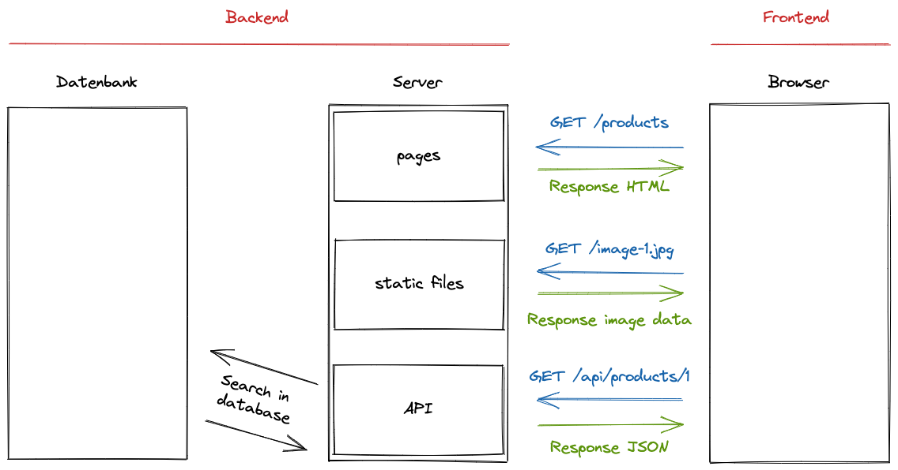

# Backend Basics

> 💡 feel free to create a personal branch of this guide to add your own notes

Recommended schedule for this session:

| duration | content         |
| -------- | --------------- |
| 1:00     | Session         |
| 1:30     | Active Learning |
| 0:15     | Recap           |

## Learning objectives

- [ ] Knowing that JavaScript can be executed outside of the browser
- [ ] Knowing Node.js is a runtime environment for JavaScript
- [ ] Understanding that the browser und Node.js provide environment specific APIs
- [ ] Knowing the terms server, backend and frontend
- [ ] Having a general understanding of the request - response mechanism

---

## Arrival: Motivate students and prepare them for today's topic(s)

> 💡 Breathe and relax :)

### Which important problem will we solve today?

Until now we focused on the frontend of a web application - everything that happens in the browser.

Today we shift the focus to the backend. We learn some basics how Next.js works under the hood to understand what a server does.

### Pose a question to be answered by the end of the block!

What is server side code?

---

## Activate prior knowledge of students

### Which previously learned concepts will be utilized in this session?

- Next.js Basics and Routing

---

## Inform: Session Guide

### Node.js - A JavaScript Runtime Environment

- [ ] Mention that students have mostly written JavaScript that was executed in the browser
- [ ] Explain that the browser is a runtime environment for JavaScript
  - [ ] A place where JavaScript code can be executed to do stuff
  - [ ] A runtime environment comes with it's own set of APIs (e.g. browser APIs, like `window` or `document`)
- [ ] Explain that there are other runtime environments for JavaScript outside of the browser
  - [ ] Open the [Node.js website](https://nodejs.org/en/)
  - [ ] Explain that Node.js can be used to execute JavaScript on your computer, a micro controller or on a server (everything that is not a browser)
  - [ ] Node.js also has it's own set of API (like `File System` or `HTTP`)
  - [ ] Point out that students have used Node.js a lot: When they type `npm` in the terminal Node.js is used to execute JavaScript
- [ ] Create a new file `index.js` anywhere on your computer and write a simple log message like this:

```js
console.log(1 + 3);
```

- [ ] Open your terminal and run this code with Node.js

```sh
node index.js
```

- [ ] Demonstrate the code gets execute
- [ ] Point out that every kind of JavaScript code could be in this file (except for browser APIs)

### Backend and Server Side Code

- [ ] Introduce students to backend and server side code by explaining this image



- [ ] Mention that "server" can mean various different things depending on the context
  - [ ] A bunch of hardware with cables and blinking lights in a server farm
  - [ ] An abstract concept of something to serve information on a network
- [ ] In our current context:

  - [ ] A process that runs on a computer (our computer / a computer provided by vercel after deployment)
  - [ ] The process _listens_ for requests and can send responses
  - [ ] The listen is tight to a specific port
  - [ ] Imagine telephone numbers inside of a big company
    - [ ] The base number is the hostname (domain or ip address) (`localhost` is always your own computer)
    - [ ] The extension at the end let's you talk to a specific person. The port is the extension at the end that lets you talk to a specific process, that listens on this port.
    - [ ] `localhost:8000` => ports like 8000, 8080, 3000, 3001 or 3002 are often used for local dev servers

### Node.js http server

- [ ] Explain that we are now going to write a simple http server (web-server) with Node.js to demonstrate that it's just a running process executing our JavaScript code

Use this demo by running this command in your Terminal:

```
npx ghcd@latest neuefische/web-exercises/tree/main/sessions/backend-basics/demo-start
```

You can check out the final version of this demo by running this command in your Terminal:

```
npx ghcd@latest neuefische/web-exercises/tree/main/sessions/backend-basics/demo-end
```

- [ ] Open the empty `server.js` file and explain that we are going to define our server inside of this file.

- [ ] Explain that we first need to import the `createServer` function from the Node.js `http` package

  - [ ] Point out this package is an API provided by Node.js and that we don't need to explicitly install it.
  - [ ] It's JavaScript that can be executed with Node.js, but not with the browser (like `window` can be used in the browser, but not with Node.js).

  ```js
  import { createServer } from "node:http";
  ```

- [ ] Explain that we can create a server with a callback function that gets called with each request to the server
- [ ] Explain that the callback receives two parameters

  - [ ] `request`: an object having information about the request send by the client / the browser
  - [ ] `response`: an object providing functions to formulate the answer to this request

  ```js
  const server = createServer((request, response) => {
    // … write response
  });
  ```

- [ ] Explain that we can formulate the response inside the callback function

  - [ ] with the `statusCode` property we can set the status code of the response (200 is the HTTP code for "Ok")
  - [ ] with the `end()` method we can say the response is complete (it should be sent) an provide the content to send back to the client

  ```js
  response.statusCode = 200;
  response.end("Hello World");
  ```

- [ ] Explain the server is defined, but not running yet.
- [ ] Explain that we will be starting the server from the `index.js` file.
- [ ] To do so we need to export the server from the `server.js` file.

  ```js
  export const server = createServer((request, response) => {
    response.statusCode = 200;
    response.end("Hello World");
  });
  ```

- [ ] Explain that we can import the server in the `index.js` file

  ```js
  import { server } from "./server.js";
  ```

- [ ] Explain that we can start the server with the `listen()` method, that takes the port as an argument

  ```js
  import { server } from "./server.js";

  const port = 8000;
  server.listen(port);
  ```

- [ ] We can pass a callback function that get's called when the server is running. This is useful to log a message to the terminal.

  ```js
  server.listen(port, () => {
    console.log(`Server running at http://localhost:${port}/`);
  });
  ```

- [ ] The complete example should look like this:

  ```js
  // server.js
  import { createServer } from "node:http";

  export const server = createServer((request, response) => {
    response.statusCode = 200;
    response.end("Hello World");
  });
  ```

  ```js
  // index.js
  import { server } from "./server.js";

  const port = 8000;
  server.listen(port, () => {
    console.log(`Server running at http://localhost:${port}/`);
  });
  ```

  > 💡 The reason why we're using one file for defining the server (`server.js`) and one file for starting the server (`index.js`) is that we can use the server definition in other files as well. For example to write tests for the server. The challenges include tests for the server, thus we are establishing this pattern from the beginning.

- [ ] Start the server from your terminal: `npm run start

  > 💡 The `npm run dev` script will use the Node.js `--watch` mode. At the time of this writing this it is still considered experimental. It requires Node.js `>18.11` but will fallback to normally starting the server if the feature is not available.
  >
  > The `--watch` mode will restart the server when you change the code.
  >
  > If you don't want to use it you can instead use `npm run start`. If you don't use it you need to restart the server manually after each change. This guide will not remind you to do so.

- [ ] Explain that we see our log message in the terminal after the server started: `Server running at http://localhost:8000/`
- [ ] Open this address in the browser and demonstrate that we see the response: "Hello World"

### Working with the `request` object

- [ ] Mention again that the `request` object gives us information about each individual request
- [ ] Explain that we like to read the requested address from `request.url`
- [ ] Change the example to look like this

```js
export const server = createServer((request, response) => {
  if (request.url === "/hello") {
    response.statusCode = 200;
    response.end("Hello World");
  } else if (request.url === "/bye") {
    response.statusCode = 200;
    response.end("Bye World");
  }
});
```

- [ ] Open `http://localhost:8000/hello` and `http://localhost:8000/bye` in the browser and demonstrate the response

### Sending a "Not Found" Response

- [ ] Explain that we need to send a response for all requests
- [ ] Create an `else` branch and send a "Not Found" response
- [ ] Use the `response.statusCode` to set the status code of the response to `404` which is the HTTP code for "Not Found"
  ```js
  else {
    response.statusCode = 404;
    response.end("Not Found");
  }
  ```

---

## Process: Challenges

- [ ] Provide the [handout](backend-basics.md) and the [challenges](challenges-backend-basics.md) to
      the students
- [ ] Open the handout and walk the students through the tasks
- [ ] Divide the students into groups
- [ ] Remind them of the ground rules:
  - meet again 30 min before lunch break in the class room
  - they can ask the coaches for help at any time
  - always try to help each other
  - take a break within the next 1.5 hrs
  - keep an eye on Slack

---

## Evaluate: Recap of the assignment / Discussion of the MVP / Solution

- Revisit the question that was posed in the beginning of the session and try to answer it with a
  few phrases.

---

## Checkout

> 💡 In case the students seem frustrated try to find some encouraging words (e.g. remind them of
> how far they have come already) :)

- [ ] Summarize the day by repeating all of the topics that were discussed
- [ ] Highlight the progress made that day
- [ ] Encourage the students to repeat what they learned with practical exercises
- [ ] Remind them to rest :)

## Keywords for Recap:

frontend, backend, server, Node.js, API, listen, hostname, port, request, response

> These keywords are for the weekly summary on Fridays. We use the keywords to automatically
> generate excalidraw tags with the help of
> [this amazing tool](https://github.com/F-Kirchhoff/tag-cloud-generator). The students structure
> the cards in a pattern that makes sense for them. Each tag, that is added to the structure needs
> to be explained in a few words by one student. We go in rounds one by one until all tags are
> included in the structure.
