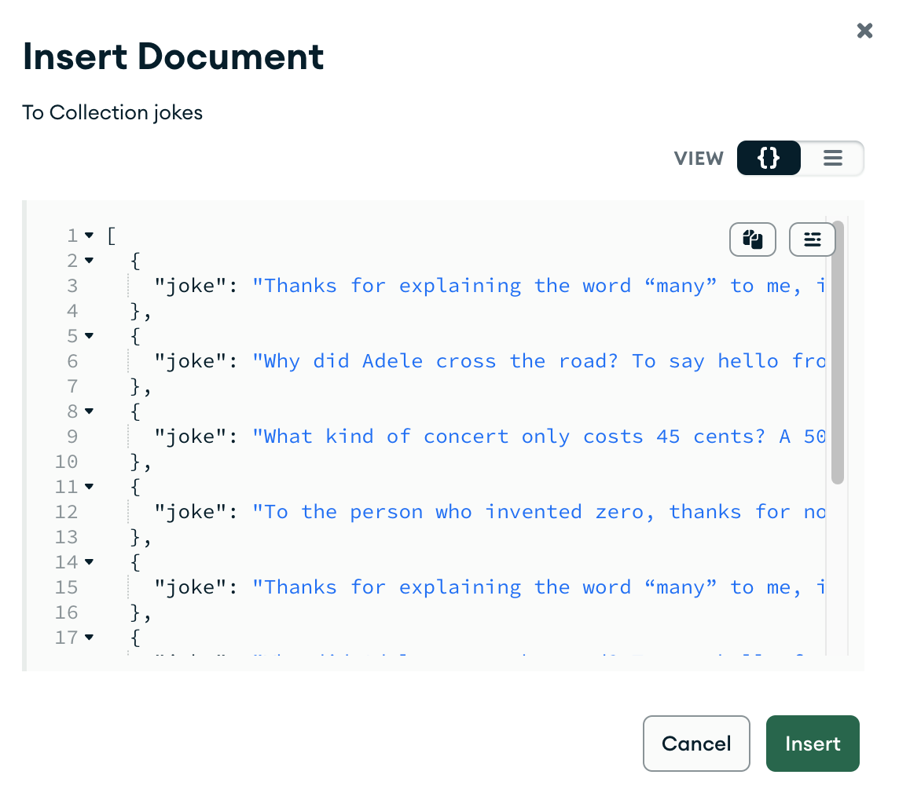

# Backend MongoDB

> 💡 feel free to create a personal branch of this guide to add your own notes

Recommended schedule for this session:

| duration | content         |
| -------- | --------------- |
| 1:00     | Session         |
| 1:15     | Active Learning |
| 0:30     | Recap           |

## Learning objectives

- [ ] Knowing the difference between a database and a server
- [ ] Knowing the difference between relational and non-relational databases
- [ ] Understanding MongoDB basics and important terms
- [ ] Knowing how to use MongoDB Atlas in order to
  - [ ] insert data
  - [ ] find and show data
  - [ ] update data
  - [ ] delete data
- [ ] Deepening the understanding of CRUD operations with databases

---

## Arrival: Motivate students and prepare them for today's topic(s)

> 💡 Breathe and relax :)

### Which important problem will we solve today?

The students have predominantly used browser-based solutions to store data, but this is not sufficient for bigger projects. This is why it's necessary to have basic knowledge of creating and communicating to a database.

### Why is the content of today's block that important for the students?

They learn what a database is, how to create one (remotely on MongoDB Atlas) and how to design the data-model.

### Pose a question to be answered by the end of the block!

How can we create a persistent database (remotely on MongoDB Atlas), in which we can store our data?

## Activate prior knowledge of students

### Which previously learned concepts will be utilized in this session?

- Backend Basics

---

## Inform: Session Guide

### Intro: Databases

- [ ] Remind students what a server is:
  - [ ] a computer that is designed to **provide services to other computers or devices**,
  - [ ] it can host a variety of services, such as a web server, an email server, a file server, or **a database server**,
  - [ ] we have used Next.js API routes as a server to request data (from a `data.js` file in the same project).
- [ ] Explain a database server:
  - [ ] it is a computer that is specifically designed to **host a database**,
  - [ ] it manages the data stored in the database,
  - [ ] it ensures that it is available to users and applications that need to access it.
- [ ] Summarize that we already know how to build a frontend and a web server (Next.js API routes), but we still need to get to know a database server.
- [ ] Explain that data storage in a database is persistent (in contrast to localStorage).
- [ ] Explain the
      [difference between relational and non-relational databases](https://www.mongodb.com/compare/relational-vs-non-relational-databases)
      (aka SQL vs NoSQL):

  - [ ] Relational:

    - [ ] data is stored in tables (like SQL or Excel),
    - [ ] the tables are connected to each other,
    - [ ] constraint: we must decide for each column what we do if we don't have data for all
          entries in this column,
    - [ ] example: store database for orders.

  - [ ] Non-relational:
    - [ ] data is stored in JSON-like structures,
    - [ ] data is stored in key/value pairs,
    - [ ] each data set in the database can have unique keys

> 💡 You can find an [in-depth explanation and comparison here](https://www.mongodb.com/compare/relational-vs-non-relational-databases).

### Intro: MongoDB

- [ ] Point out that, so far, the students have been using `localStorage` to persist data.
- [ ] Remind students that `localStorage`
  - [ ] has a limited capacity (usually around 5MB),
  - [ ] is stored in the browser of a user's computer or device,
  - [ ] is specific to the web page or application that created it and the browser that is being used,
  - [ ] its data can be deleted if the user manually deletes the browser's cache and other data;
  - It might be [deleted based on the LRU Policy](https://developer.mozilla.org/en-US/docs/Web/API/IndexedDB_API/Browser_storage_limits_and_eviction_criteria#lru_policy) (Last Recently Used)
  - [ ] This is why `localStorage` is not well-suited for storing large amounts of data or data that needs to be accessed and shared by multiple applications or users.
- [ ] Point out that a database, in contrast,

  - [ ] can store much larger amounts of data than LocalStorage, and
  - [ ] can also be accessed by **multiple applications and users**, so the data can be **shared**.

- [ ] Explain why we are using MongoDB:
  - [ ] As a non-relational database, MongoDB is less strict and easy to use.
- [ ] Explain the name:
  - [ ] The name MongoDB is a shortened version of "humongous".
  - [ ] The name was chosen to reflect the scalability and flexibility of the database.
  - [ ] The "DB" in the name stands for "database," indicating that MongoDB is a type of database.

---

### MongoDB Atlas

#### Introduction to MongoDB Atlas

- [ ] Open MongoDB Atlas (https://cloud.mongodb.com/).

- [ ] Explain that this is an online service which provides us with a UI for our databases.

- [ ] Use the "Browse collections" button and then "+ Create Database" on the following page.

- [ ] Explain the term **Database**:

  - [ ] A MongoDB database is a collection of data that is organized and stored in a specific way, using the MongoDB database management system.
  - [ ] A MongoDB database can have different _collections_.

- [ ] Explain the term **Collection**:

  - [ ] A collection is a grouping of MongoDB _documents_.
  - [ ] Documents within a collection can have different fields.
  - [ ] A collection is the equivalent of a table in a relational database system.
  - [ ] A collection exists within a single database.

- [ ] Explain the term **Document**:

  - [ ] A MongoDB document is a _JSON-like data structure that consists of key-value pairs_.
  - [ ] These key-value pairs are called _fields_.

- [ ] Explain the term **Fields**:

  - [ ] In MongoDB, a field is a _key-value_ pair that is stored in a _document_.
  - [ ] A field represents a specific piece of data within a document, and it consists of a field name (key) and a field value.
  - [ ] The field name is a string that identifies the field, and the field value is the data stored in the field.

- [ ] Continue setting up your database:

  - [ ] the database is called _jokes-database_ and
  - [ ] the collection is called _jokes_.
  - [ ] Note that the database's name contains "jokes" because in our case, everything will have to do with jokes; however, this is not a convention, so the name can be chosen more freely.

- [ ] Show the two ways to insert some data via the "INSERT DOCUMENT" button:
  - [ ] "Insert Document" to add a single data object (= _document_)
    - [ ] Note that the `_id` is added automatically.
    - [ ] Add a joke below the `_id` so that it looks like this:

```json
{
  "_id": {
    "$oid": "63a43dcfd67b0ad32f43c867"
  },
  "joke": "How do you organize an astronomer's party? You planet."
}
```

- [ ] "Insert Document" to _add multiple_ data objects (= _documents_)

  - [ ] You can use [this `jokes.json` file](assets/jokes.json)
  - [ ] Copy the file contents and paste them into the text field.
        Show that the `_id` field is added automatically.



- [ ] Show that all inserted documents are present in the overview.
- [ ] Filter the data with the "Filter" input field:
  - [ ] Find a specific joke text with `{ joke: "Thanks for explaining the word “many” to me, it means a lot." }`.
  - [ ] Find a joke by its Id (`_id`) with `{ _id: ObjectId("[id_goes_here]")}`.

---

## Process: Challenges

- [ ] Provide the [handout](backend-mongodb.md) and the [challenges](challenges-backend-mongodb.md)
      to the students
- [ ] Open the handout and walk the students through the tasks
- [ ] Divide the students into groups
- [ ] Remind them of the ground rules:
  - meet again 30 min before lunch break in the class room
  - they can ask the coaches for help at any time
  - always try to help each other
  - take a break within the next 1.5 hrs
  - keep an eye on Slack

---

## Evaluate: Recap of the assignment / Discussion of the MVP / Solution

- Revisit the question that was posed in the beginning of the session and try to answer it with a
  few phrases.

---

## Checkout

> 💡 In case the students seem frustrated try to find some encouraging words (e.g. remind them of
> how far they have come already) :)

- [ ] Summarize the day by repeating all of the topics that were discussed
- [ ] Highlight the progress made that day
- [ ] Encourage the students to repeat what they learned with practical exercises
- [ ] Remind them to rest :)

## Keywords for Recap:

relational database, non-relational database, MongoDB, term: database, term: collection, term: document, term: field, CRUD

> These keywords are for the weekly summary on Fridays. We use the keywords to automatically
> generate excalidraw tags with the help of
> [this amazing tool](https://github.com/F-Kirchhoff/tag-cloud-generator). The students structure
> the cards in a pattern that makes sense for them. Each tag, that is added to the structure needs
> to be explained in a few words by one student. We go in rounds one by one until all tags are
> included in the structure.
