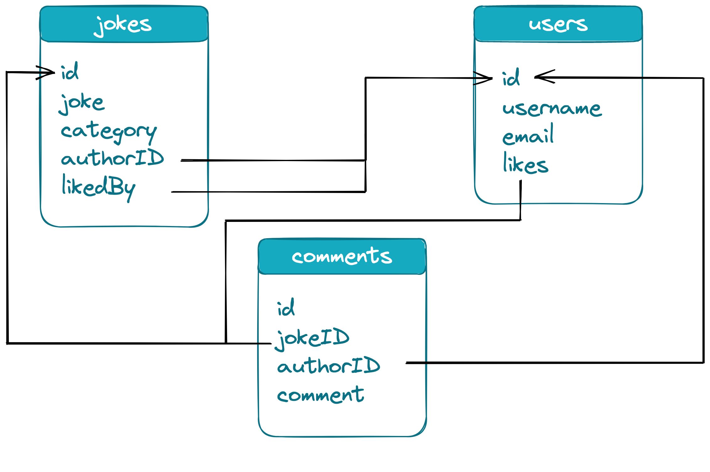

# Backend MongoDB

## Learning Objectives

- [ ] ...topics from session guide...
- [ ] Having basic knowledge of database design:
  - [ ] how to structure collections (foreign keys, references)
  - [ ] how to structure documents (nested objects)
  - [ ] one to one (1:1)
  - [ ] one to many (1:n)
  - [ ] many to many (n:m)

---

## Intro Database

- what is a database?
- relational vs. non-relational
- persistent storage
-

- ACID Compliance: https://www.mongodb.com/basics/acid-transactions
  - Principles that databases should fulfill
  - ACID = Atomicity, Consistency, Isolation, Durability

---

## Intro MongoDB

- explain terminology
  - database
  - collection
  - document
  - field
- queries
  - find
  - findOne
  - insert
  - update
  - delete
- link to docs

---

## database design

_Draft_: Refactor the following to fit the handout format.

### Database Design

- [ ] Explain how best to design your database:
  - [ ] Design your collections and documents around the data you need to store and the queries you need to perform.
  - [ ] Use arrays to store lists of related data within a single document.
  - [ ] Use nested objects to store complex data structures within a single document. For example, if you have a **comments** collection and you want to store the text content of a comment as well as the amount of likes a comment received, you'd need a nested object structure.
  - [ ] If you want to reference an object that is stored in a different collection, you can use foreign keys:
  - [ ] For example:
    - [ ] If you have a **users** collection and a **jokes** collection, you can use a foreign key in the **jokes** collection to store a reference to the user who created each joke.
    - [ ] This allows you to store information about the user who created each joke, without duplicating data in the jokes collection.

### Database Relationships

**One-To-One**

- [ ] A one-to-one relationship in MongoDB exists when a document in one collection is related to at most one document in another collection. This can be implemented by storing a reference to the related document in the first collection.

**One-To-Many**

- [ ] A one-to-many relationship in MongoDB exists when a document in one collection is related to multiple documents in another collection. This can be implemented by storing an array of references to the related documents in the first collection.

**Many-To-Many**

- [ ] A many-to-many relationship in MongoDB exists when a document in one collection is related to multiple documents in another collection, and vice versa. This can be implemented by storing an array of references in each collection.

### Example Visualization

- [ ] Visualize the example below in Excalidraw
  > 💡 The following data structure with three collections should only be used for demo purposes in this session. Upcoming sessions will only use a more simple version of the `jokes` collection.

```json5
// Jokes collection:
{
  "_id": ObjectId("joke1ID"),
  "joke": "Why do programmers hate nature? It has too many bugs.",
  "category": "programming",
  "authorId": ObjectId("user1ID"),
  "likedBy": [ObjectId("user2ID"), ObjectId("user3ID")]
}

// Users collection:
{
  "_id": ObjectId("user1ID"),
  "username": "jane.doe",
  "email": "jane.doe@example.com",
  "likes": [ObjectId("joke1ID"), ObjectId("joke2ID")]
}

// Comments collection:
{
  "_id": ObjectId("comment1ID"),
  "jokeId": ObjectId("joke1ID"),
  "authorId": ObjectId("user1ID"),
  "comment": {
    "text": "That's a good one!",
    "likesReceived": 10
  }
}

- [ ] Feel free to use the following example as a _guideline_ for your own visualization process.
      

- [ ] While visualizing the example collections, make sure to explain the following concepts:

  - [ ] Each document in the collections has an id field that is a unique identifier.
  - [ ] Each joke document has a joke field that stores the text of the joke, a category field that stores the category of the joke, and an authorId field that stores the ID of the user who created the joke, which establishes a **one-to-one** relationship between the joke and the user collection.
  - [ ] Each joke document has a likedBy field that is an array of user IDs representing the users who have liked the joke. This implements a **many-to-many** relationship between the jokes and users collections, as a user can like multiple jokes and a joke can be liked by multiple users.

  - [ ] Each user document has a username field that stores the user's username and an email field that stores the user's email address.
  - [ ] Each user document has a likes field that is an array of joke IDs representing the jokes that the user has liked. This implements a **many-to-many** relationship between the jokes and users collections, as a user can like multiple jokes and a joke can be liked by multiple users.

  - [ ] Each comment document has a jokeId field that stores the ID of the joke that the comment is associated with, an authorId field that stores the ID of the user who created the comment, and a comment field that stores the text of the comment.
  - [ ] The jokeId field and authorId field implement **one-to-many** relationships between the comments, jokes, and users collections, as a joke can have multiple comments and a user can create multiple comments, but each comment can only be associated with one joke and one user.
  - [ ] The comment field also has a likesReceived field that stores the number of likes the comment has received to showcase the concept of nested objects.

---

## Resources
```
