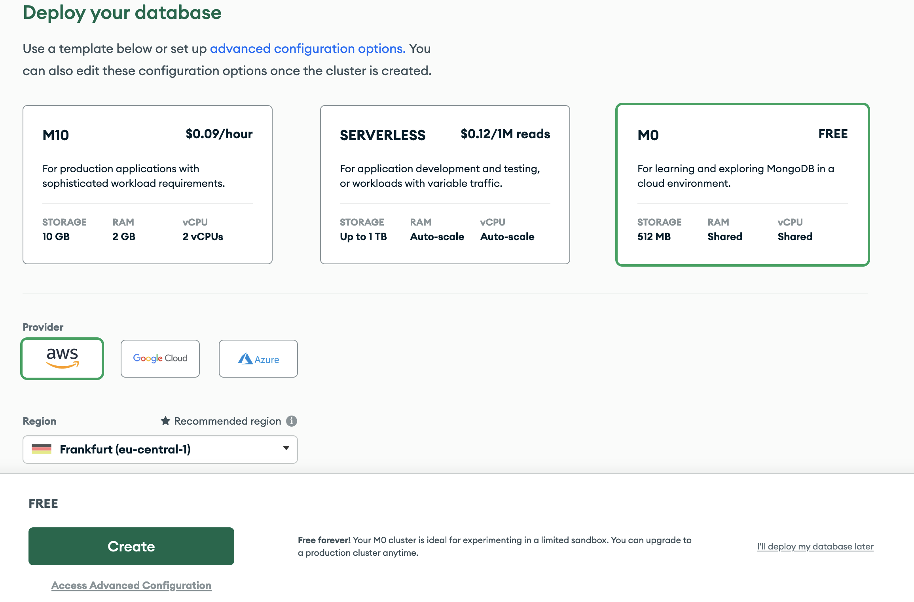
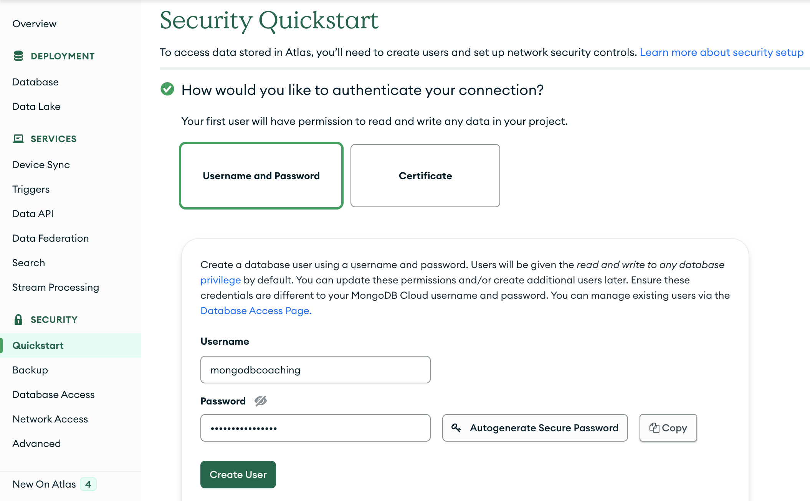
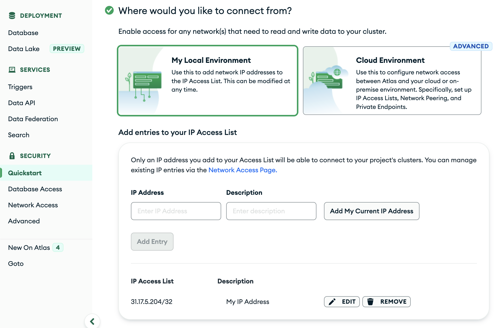
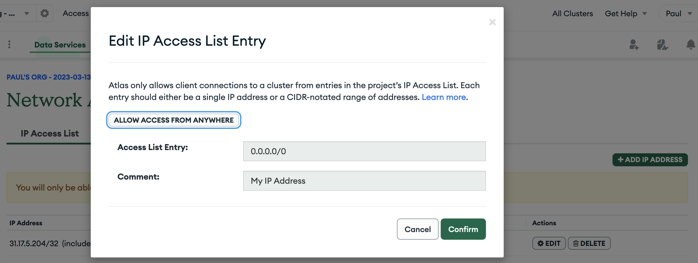
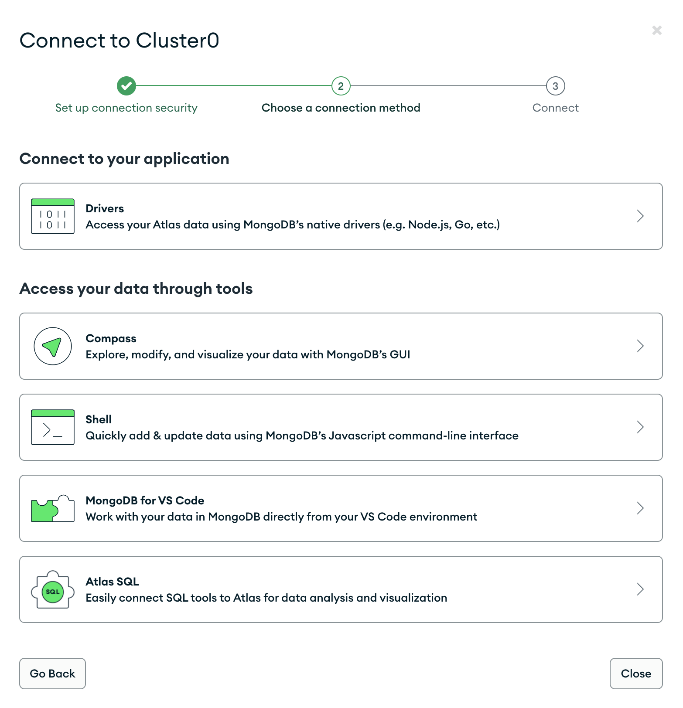
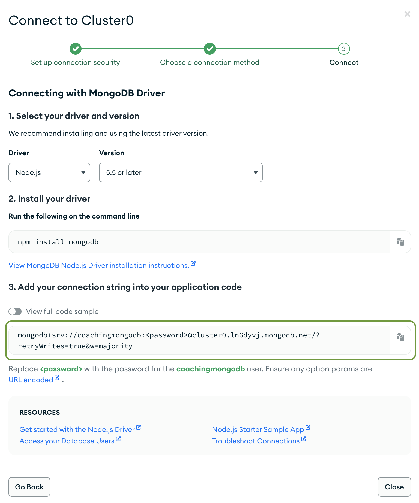

# Challenges: Backend MongoDB

## Setting up a MongoDB Atlas account and database

Follow this guide to set up your MongoDB Atlas account and your first database.

1. Go to [the MongoDB Atlas homepage](https://www.mongodb.com/atlas/database) and choose "Try Free" to start the process.
2. Create an account by providing your data or sign up using Google.
3. You might need to verify your email address.
4. You might be asked to tell MongoDB Atlas something about your future use cases:

5. To create a cluster, choose
   1. `M0 Free`,
   2. `aws`, and
   3. `Frankfurt` and click on "Create".

6. In the left-hand navigation, choose `Security > Quickstart` to generate a first user. You might be led to this screen automatically after creating the cluster.
   1. Choose a username and a password.
   2. 🚨 Make sure to write down your password!
   3. Click on "Create User".

7. Scroll down to choose where you would like to connect from:

   1. Choose "My Local Environment".
   2. Click "Add My Current IP Address".

   Your IP address might have been added automatically.

8. In the left-hand navigation, choose `Security > Network Access`.

9. In the IP Access List, behind your IP Address, click on "Edit".
10. In the pop-up window, click "Allow Access from Anywhere".

11. Your Network Access tab should now look like this:

12. In the left-hand navigation, choose `Deployment > Database` which brings to this view:

13. On the right side of your cluster's name (here "Cluster0"), click the "Connect" button.

14. In the pop-up window, click `Connect to your application > Drivers`:

15. You should now see this screen:

16. Click on "Choose a connection method". You will see a screen similar to the following:

17. We will later need the connection string for our application. Click on "Copy" to copy it to your clipboard. It should look similar to this:

`mongodb+srv://coachingmongodb:<password>@cluster0.mu12zrz.mongodb.net/?retryWrites=true&w=majority`

18. Note the hint below: `Replace <password> with the password for the coachingmongodb user.`

    > This is the database user you have created before. Your database user might have a different name.

19. Store this connection string in a safe place, e.g. in a text file. You will need it later.

## Resources

- [MongoDB Atlas Tutorial](https://www.mongodb.com/basics/mongodb-atlas-tutorial)
- [Environment Variables (Vercel Docs)](https://vercel.com/docs/concepts/projects/environment-variables)
