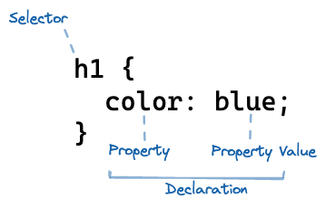

# CSS Basics

## Learning Objectives

- Having a general understanding of the purpose of CSS
- Knowing what Cascading Style Sheets means
- Understanding the fundamentals of CSS: CSS syntax, selectors, box model,
  inline & block elements
- Linking stylesheets to the HTML document
- Getting to know the Developer Tools in the browser

## Requirements

- HTML Basics

## Demo

### Start

```
npx ghcd@latest wd-bootcamp/web-exercises/tree/main/sessions/css-basics/demo-start
```

### End

```
npx ghcd@latest wd-bootcamp/web-exercises/tree/main/sessions/css-basics/demo-end
```

---

## Session Guide

Now that we know how to structure our web pages with HTML, it’s time to learn how to style those elements with CSS. When building web pages, we often need to change how our HTML elements look to match a design. CSS allows us to efficiently apply styles to multiple elements, ensuring our page looks consistent without repeating the same code over and over.

> How can you style HTML elements as efficiently as possible? How can you apply the same styles to multiple elements on a web page without repeating code?

### What is CSS?

- Explain that CSS means _Cascading Stylesheets_. We use CSS to add layout, colors, positioning or other decorations to elements on the page.

### Syntax

- Explain the syntax of a CSS ruleset (you don't have to explain every part in depth):

  - **Selector** — A CSS selector is used to specify the elements to which CSS rules apply.
  - **Property** — Name for a particular property to which a value is attributed.
  - **Value** — The value we assign to a property.
  - **Declaration** —Each pair of property and value is a declaration.

[<br />🔗 Open sketch in Excalidraw](https://excalidraw.com/#json=6vTcgdviz8myOb-GrVCpe,zqt5qrO_mqG-hWCTMEwJRQ)

### Link the Stylesheet

- Explain that a stylesheet

  - is a separate file where all the styles are written
  - and uses the `.css` file extension.

- Explain that we could use any convention for how to call our stylesheet, but we will call the file `styles.css` and place it in a separate `css` folder.

- Note that we need to link the `styles.css` file inside the `index.html` so that the browser knows from where to load the styles.
- Link both files by adding a `link` element to the `head` of the `index.html`.

  ```html
  <link rel="stylesheet" href="./css/styles.css" />
  ```

### Add the first styles

- Add the following styles to the `styles.css` file:

  ```css
  h1 {
    color: blue;
  }
  ```

- Explain that the above CSS code will make all `h1` elements blue.

  - The `h1` is the selector and `color: blue;` is the declaration.
  - `h1` is a type selector, which means that it will select all `h1` elements on the page.

- Show that you can add multiple declarations to the same selector:

  ```css
  h1 {
    color: blue;
    font-size: 2rem;
  }
  ```

> 💡
> It makes sense to add comments to your CSS code to explain what you are doing. Show students how to add comments to their CSS code:
>
> ```css
> /* make all h1 elements text be blue and 2rem big */
> ```

### Class selector

- Explain that we want to make the first paragraph italic (cursive), but not all paragraphs.

- Add the following CSS code to the `styles.css` file:

  ```css
  p {
    font-style: italic;
  }
  ```

- Explain that the above CSS rule will make all `p` elements italic.

  - The `p` is the selector and `font-style: italic;` is the declaration.
  - `p` is a type selector, which means that it will select all `p` elements on the page.

- Point out that we want to make only the first paragraph italic.
- Add a class attribute of `introduction` to the first paragraph:

  ```html
  <p class="introduction">…</p>
  ```

- Change the selector:

  ```css
  .introduction {
    font-style: italic;
  }
  ```

- Explain that the above CSS code will make all elements with the class `introduction` italic.

  - `.introduction` is the selector and `font-style: italic;` is the declaration.
  - `.introduction` is a class selector, which means that it will select all elements with the class `introduction` on the page.

- Explain that a class selector is always written with a dot `.` in front of the class name.

> 💡
> You can show that Visual Studio Code (and other editors) will help you with the syntax by showing the class name in a different color. Also you can hover over the selector to see a preview of the elements that will be selected. This works for all kinds of selectors.

### Property Playground 🎨

- Play around with some of the following properties to show that you can change the look of an element:

  - `background-color`
  - `color`
  - `border`
  - `border-radius`
  - `text-decoration`
  - `font-size`
  - `margin`
  - `padding`
  - …

- Explain that we cannot show all properties in this session, but that students can find a [🔗 **list of all properties** on mdn](https://developer.mozilla.org/en-US/docs/Web/CSS/Reference). (The reference also includes pseudo-classes, pseudo-elements, data types, functional notations and at-rules.)

> 💡
> At this point in your demo, you might want to show that the styles disappear when you remove the `<link>` to the stylesheet in the `index.html` file. Not adding the `<link>` element is a common mistake that students will make.
>
> You can introduce the idea of _sanity checks_. Sanity checks are a way to make sure that the code is working as expected. In this case, we could add a background color to the `body` element to make sure that the stylesheet is linked correctly:
>
> ```css
> body {
>   background-color: hotpink;
> }
> ```

### Inheritance

- Explain that elements inherit _some_ properties from their parents - but not _all_.

- Add the following CSS code to the `styles.css` file:

  ```css
  body {
    font-family: system-ui;
  }
  ```

- Explain that the above CSS code will make all text on the page use the system font.

  - This is because the `body` element is the ancestor element of all visible elements on the page and the `font-family` property is inherited by default.
  - This behavior is very useful, because it means that we don't have to add the `font-family` property to every element on the page.

- Other properties that are inherited by default are:

  - `color`
  - `font-size`
  - `font-style`
  - `font-weight`
  - …

### Hover Styles

- Explain that we can change the styles of the link element when the user hovers over it.
- Add the following CSS rule to the `styles.css` file:

  ```css
  a:hover {
    color: hotpink;
  }
  ```

- Explain that the above CSS rule will make all links hotpink when the user hovers over them.
  - `a:hover` is the selector and `color: hotpink;` is the declaration.
  - `a:hover` is a pseudo-class selector, which means that it will select all links when the user hovers over them.
- Explain that the `:hover` part is called a pseudo-class. Pseudo-classes are keywords that can be added to selectors to **select a specific state of the element**.
- Explain that there are other pseudo-classes (for other states) that can be found in the handout.

### An important reset: `box-sizing: border-box;`

- Add the following CSS rule to the `styles.css` file:

  ```css
  * {
    box-sizing: border-box;
  }
  ```

- Explain that the above CSS rule will be in all future projects to **reset a browser setting, that would otherwise make it hard to calculate the width or height of an element**. For now students must trust you that this is a good thing to have.

> ❗️
> Keep this section very brief. For the curious, a detailed explanation can be found in the
> handout.

### Learning to Use Dev Tools for CSS

- Demonstrate how to select an element on the page using the "Inspect" tool.
- Show how to open Dev Tools in different browsers (usually Cmd+Opt+I on Mac, Ctrl+Shift+I on Windows ).
- Navigate to the 'Elements' tab to view the HTML structure and corresponding CSS.
- Explain how the Dev Tools provide a live view of the CSS applied to each element.
- Show how changes can be made 'on-the-fly' to test new styles.
- Discuss the importance of copying working styles from Dev Tools back to the source code.

> 💡 Dev Tools are an invaluable resource for debugging CSS. Encourage students to use Dev Tools to understand how CSS styles are applied and to tweak styles in real-time

### Demo CSS

The full CSS for the demo could look like this (comments are added for explanation):

```css
/* CSS reset that makes working with width and height easier
   and should always be in your stylesheet. */
* {
  box-sizing: border-box;
}

/* The font-family property is inherited to all child elements by default */
body {
  font-family: system-ui;
}

/* All links (anchors) are hotpink when the user hovers over them */
a:hover {
  color: hotpink;
}

/* make all h1 elements text be blue and 2rem big */
h1 {
  color: blue;
  font-size: 2rem;
}

/* All elements with the class introduction are italic (and fancy) */
.introduction {
  font-style: italic;
  background-color: lightblue;
  padding: 16px;
  border-radius: 8px;
}
```

## Web-Challenges Workflow

- Show the students the [web challenges workflow](https://github.com/neuefische/web-protocol-template/blob/main/docs/challenge-workflow.md). They have a copy in their cohort repository.
- Make sure, that they understand it and remind them to follow this workflow from now on when working on challenges.
- If you teach a Spiced cohort, explain the students to post the PR link into the slack session solutions thread and to review other solutions.
