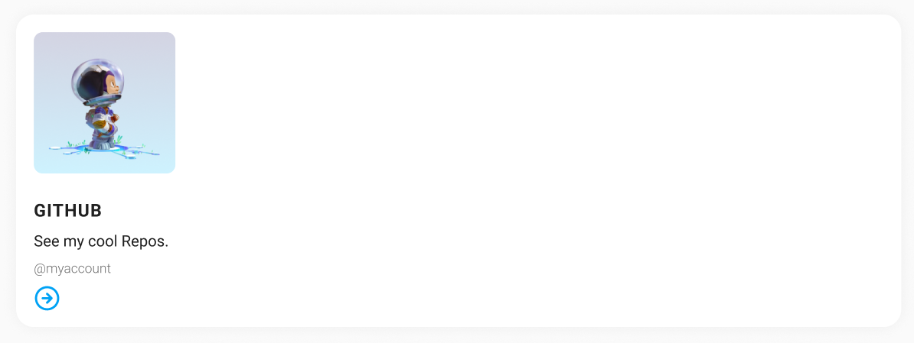

# CSS Basics: Challenges

## Social Card

Open
[this CodeSandbox](https://githubbox.com/neuefische/web-exercises/tree/main/sessions/css-basics/social-card).
You will find an unstyled HTML page. Your task is to recreate the following social card.

- [ ] Fork the CodeSandbox.
- [ ] [Add the link](#linking-stylesheets) to the styles.css stylesheet in the head of the
      index.html file.
- [ ] Style all elements on the page to recreate these social card styles.
- [ ] Use type selectors as well as class selectors to target the correct elements.
- [ ] Find a fitting font on fonts.google.com and [import it into your project](#styling-fonts).

## Personal Website Styling

Start styling your personal website to make it absolutely fabulous. ✨

- [ ] Add a style.css file to your project and [link it correctly](#linking-stylesheets) in your
      index.html file.
- [ ] Get creative and find your very own style for your personal website.
- [ ] [Include a font](#styling-fonts) into your website.
