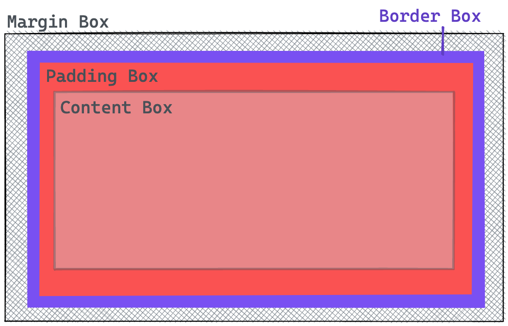

# CSS Basics

## Learning Objectives

- having a general understanding about the purpose of CSS
- knowing the meaning behind the name CSS (`Cascading Style Sheets`)
- understanding the fundamentals of CSS: `CSS syntax`, `selectors`, `box model`,
  `inline & block elements`
- using stylings for fonts
- linking stylesheets to the HTML document

---

## What is CSS?

With CSS you can add styling to your HTML elements.


---

## CSS syntax

The structure of how to write CSS is also called **ruleset**. It consists of four parts:


| Part           | Description                                                                                       |
| -------------- | ------------------------------------------------------------------------------------------------- |
| Selector       | Addresses the element(s) to style                                                                 |
| Declaration    | Defines what to change and contains pairs of `property` and `property value`                      |
| Property       | The name of the property to change                                                                |
| Property Value | The value assigned to the property, e.g for the property `color` we use the property value `blue` |

A ruleset can have `multiple declarations`:

```css
h1 {
	color: blue;
	font-size: 3rem;
	text-align: center;
}
```

You could also select multiple elements and style them with the same ruleset:

```css
h1,
h2,
h3 {
	color: red;
}
```

---

## Basic Selectors

There are different CSS selectors you can use to style elements. The most common ones are:

- **Universal selector** `*` selects all elements.
- **Element or Type selector**, like `article`, selects all elements of a specific type.
  ```css
  article {
  	color: red;
  }
  ```
- **Class selector**, like `.class-name`, selects all elements with the specified class.
  ```css
  .my-cool-class {
  	color: hotpink;
  }
  ```
  ```html
  <aside class="my-cool-class">...</aside>
  ```

> ❗️ In theory you could also use element IDs as selectors, but this is bad practice and must be
> avoided.

---

## CSS Properties

There are a lot of CSS properties and you will discover new ones every day. Therefore the following
list shows only a few examples:

| Property           | Effect                                         |
| ------------------ | ---------------------------------------------- |
| `color`            | Color of an element´s text                     |
| `font-size`        | Defines the size of a font                     |
| `text-align`       | Defines the alignment of text                  |
| `background-color` | Background color of an element                 |
| `border`           | Defines the border of an element.              |
| `padding`          | Defines the padding of an element.             |
| `margin`           | Defines the margin of an element.              |
| `width`            | This property defines the width of an element. |

> 💡 You can find more properties in the
> [CSS Properties Reference](https://developer.mozilla.org/en-US/docs/Web/CSS/Reference#index) on
> MDN.

---

## Box Model

All elements of a website are wrapped in a **box model**. It's a way to define the size and position
of an element. There are four different parts: `content`, `padding`, `border` and `margin`.

| box model part | Function                                                 |
| -------------- | -------------------------------------------------------- |
| `content`      | The actual content of the element.                       |
| `padding`      | Space between the content and the border of the element. |
| `border`       | The border of the element.                               |
| `margin`       | The space around the border and other elements.          |

The property `box-sizing` changes the way how the `width` and `height` of an element is calculated.
The default value is `content-box`. The values of `width` and `height` set the size of the "content
box". With the value `border-box`, the size of the "border box" is set instead.

```css
* {
	box-sizing: border-box;
}
```

Now, the `width` property defines the size of the border box, padding and border width are
subtracted to calculate the available space for the content.



---

## Inline and block elements

There are basically two types of elements: inline-level and block-level elements.

- **Inline elements** occupy the space as required by the element itself and are placed inside the
  text lines.
- **Block elements** occupy the full horizontal space of the parent element and begin a new line.

Example:

```html
<!-- "h2" is a block-level element -->
<h2>Coding Bootcamp</h2>
<!-- "p" is a block-level element. The "a" inside is an inline-level element -->
<p>
	If you want to participate in a bootcamp, visit
	<a href="https://www.neuefische.de">neuefische.de</a>
</p>
```

You can change this behavior by using the CSS `display` property.

---

## Styling fonts

With CSS you can style the fonts of your website in many ways. Here are just some examples:

- `font-family`: Defines the font family of an element
- `font-size`: Size of a font
- `font-weight`: This property defines the weight of a font

You can include custom fonts in different ways:

- find a font on [google fonts](fonts.google.com) and use the `@import` snippet and paste it to the
  top of your css file:
  ```css
  @import url('https://fonts.googleapis.com/css2?family=Red+Hat+Mono:wght@300;			400;500;700&display=swap');
  ```
- use the provided HTML code to add the font via the `link` element in the `head` of your HTML file:

  ```html
  <link rel="preconnect" href="https://fonts.googleapis.com" />
  <link rel="preconnect" href="https://fonts.gstatic.com" crossorigin />
  <link
  	href="https://fonts.googleapis.com/css2?family=Bangers&family=Montserrat&display=swap"
  	rel="stylesheet"
  />
  ```

- download any font and include it as a `font-family`

  ```css
  @font-face {
  	font-family: 'Name of the font';
  	src: url('path/to-the/font.woff');
  }
  ```

  You can use the [google webfonts helper](https://google-webfonts-helper.herokuapp.com/fonts) which
  will provide you with the fonts file and create the necessary css rules for you.

> ❗️ For legal reasons you should choose the option to download the font and include it as a
> font-family.

---

## Linking Stylesheets

To separate your HTML and CSS code, you can create a new file, like **styles.css** and link it to
your HTML file by placing a `<link>` tag in the `<head>` of your HTML document.

```html
<head>
	...
	<link rel="stylesheet" href="styles.css" />
</head>
```

---

## Resources

- [Common CSS Properties](https://developer.mozilla.org/en-US/docs/Web/CSS/CSS_Properties_Reference)
- [MDN: CSS - First Steps](https://developer.mozilla.org/en-US/docs/Learn/CSS/First_steps)
- [Styling text](https://developer.mozilla.org/en-US/docs/Learn/CSS/Styling_text)
- [CSS Tricks: Box-sizing](https://css-tricks.com/box-sizing/)
- [Josh Comeau: Surprising truth about pixels and accessibility](https://www.joshwcomeau.com/css/surprising-truth-about-pixels-and-accessibility/)
- [rem/px calculator](https://nekocalc.com/de/px-zu-rem-umrechner)
