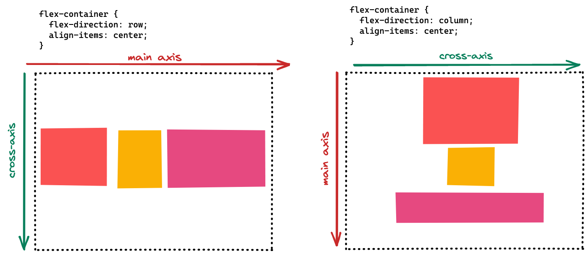

# CSS Flexbox

## Learning objectives

- Understanding the purpose of flexbox:
  - Let items fill out the possible space in their container
  - Distributing elements for different screen sizes
  - Make the website more responsive with flexbox
- Understanding the most important flexbox properties:
  - `justify-content`
  - `align-items`
  - `flex-direction`
  - `flex-wrap`
  - `gap`
- Knowing the difference between `main-axis` and `cross-axis`

---

- In a normal document flow block-level elements are displayed below each other.
- Altering this behavior is important to realize an appealing layout with a well-defined visual
  structure that can be consumed easier by users.
- In addition elements should be distributed on the page based on the viewport size to make use of
  the available space.

### Why is the content of today's block that important for the students?

- It is possible to distribute elements on the page with traditional ways of styling (e.g. float,
  position, margin).
- However, modern layouts consist of many reuseable parts and need to respond to different viewport
  sizes.
- This would be hard to implement with such tools and leads to very complex and inflexible code.

### Question

How can we create a horizontal navigation bar that adjusts to the viewport's width by increasing the
space between the navigation links?

---

### Required

- HTML Basics
- CSS Basics
- CSS box model

You can ask these questions:

- Have you ever tried to align elements besides each other?
- Have you ever tried to center an element horizontally and vertically within a parent element?

---

## Session Guide

### Document Normal Flow

Use this demo by running this command in your Terminal:

```
npx ghcd@latest neuefische/web-exercises/tree/main/sessions/css-flexbox/demo-start
```

You can check out the final version of this demo by running this command in your Terminal:

```
npx ghcd@latest neuefische/web-exercises/tree/main/sessions/css-flexbox/demo-end
```

- Show the code and the normal document flow of the demo.
- Note what we want to achieve:
  - a horizontal navigation bar that
  - adjusts to the viewport's width by increasing the space between the navigation links.

### General understanding: defining a flexbox, axis, and direction

- Explain how flexbox works in general:

  - We need to create a flexbox **container** as a wrapper.
  - All **direct children** are **flex-items** to which the styles are applied.

- Switch to the `index.html` and show that the common parent element (= container) for all navigation items is the `ul` with `class="menu"`.
- Switch to `styles.css` and identify the corresponding class selector `.menu {}`.
- Make the `ul` a flex container and show the difference in the browser:

```css
.menu {
  font-size: 22px;
  display: flex;
}
```

- Note that the **direction** of the flexbox is set via the `flex-direction` property which defaults to horizontal.
- Change the `flex-direction` to `column` and show the difference:

```css
.menu {
  font-size: 22px;
  display: flex;
  flex-direction: column;
}
```

- Show the following image to recap and explain:
  - flex container
  - flex items
  - `flex-direction`: `row` (default) and `column`
    - The `flex-direction` property defines the `main-axis`.
    - The `cross-axis` is perpendicular.
  - Make the students aware of `justify-content` (main-axis) and `align-items` (cross-axis):
    - these properties define where to place the flex items along the `main-axis` / `cross-axis`;
    - we'll use them in the next step to adapt our flex items.



### Important CSS properties for flexbox

- Introduce the following flexbox properties and show the effect of different values:

> 💡 To visualize the differences even better, you may want to give `.menu` and `.menu > li` a border.

- `justify-content`: Alignment on the `main-axis`
  - `flex-start` (default): Items are placed **at the start of the flex-direction**.
  - `center`: Items are **centered along the line**.
  - `space-between`: Items are **evenly distributed in the line**; first item is on the start line, last item on the end line.
  - `space-evenly`: Items are distributed so that the **spacing between any two items (and the space to the edges) is equal**.
- `align-items`: Alignment on the `cross-axis`
  - ❗️ Make sure to set the `height` property on the flex container to show behavior.
  - `stretch` (default): Stretch items to **fill the container**.
  - `flex-start`: Items are placed **at the start of the cross axis**.
  - `flex-end`: Items are placed **at the end of the cross axis**.
  - `center`: Items are **centered in the cross-axis**.
- `gap`: Creates visual space between flex items.
- `flex-wrap`: Flex items can wrap into another row instead of being squashed into one row
  - `nowrap` (default): All flex items will be on one line.
  - `wrap`: Flex items will wrap onto multiple lines, from top to bottom.

---
