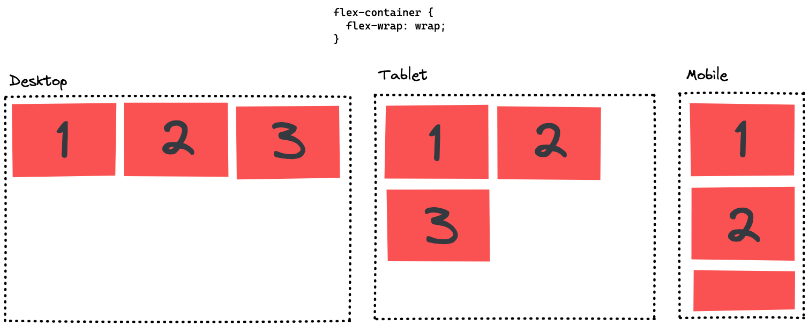

# CSS Flexbox

## Learning Objectives

In this session you will learn:

- [ ] Understanding the purpose of Flexbox:
  - [ ] let items fill out the possible space in their container
  - [ ] distributing elements for different screen sizes
  - [ ] make the website more responsive with flexbox
- [ ] Understand and use of most important flexbox properties

---

## Flexbox

Flexbox is a powerful CSS tool to layout your HTML elements, especially when you want to align elements horizontally. It is defined on a container element, containing multiple elements whose position will be determined by the flexbox rules. You define it as follows:

```css
.container-element {
  display: flex;
}
```

Flexbox does the following:

- All child elements will be displayed next to each other along the `main axis`, the horizontal axis by default. The perpendicular axis is called `cross axis`.
- If the width of all child elements exceed the container width, the child elements will be shrunk such that they all fit into the available space.

This behaviour can be modified to achieve some very useful layouts. The most important flex properties are listed in the following table.

## Important Flex Properties

| property          | effect                                                                                                                                         |
| ----------------- | ---------------------------------------------------------------------------------------------------------------------------------------------- |
| `justify-content` | defines the positioning of elements along the `main axis`. Useful values: `flex-start`, `flex-end`, `center` , `space-between`, `space-evenly` |
| `align-items`     | defines the positioning of elements along the `cross axis`. Useful values: `flex-start`, `flex-end`, `center`                                  |
| `gap`             | defines the minimum spacing between elements.                                                                                                  |
| `flex-direction`  | sets the direction of the main axis. Useful values: `row`, `column`                                                                            |
| `flex-wrap`       | modifies how elements can wrap into another row instead of being sqashed into one row. Useful values: `wrap`, `no-wrap`                        |

> 💡 [This very detailed cheatsheet](https://css-tricks.com/snippets/css/a-guide-to-flexbox/) includes everything you will ever need when working with flexbox.

## Flex-direction

This very fundamental property lets you define which axis should act as main axis. In this picture you can see its effect.


As you can see it changes the layout completely. Also notice, that the property align-items, which defines the positioning on the cross axis, also changes with the definition of the flex-direction.

## Flex-wrap

This property is very useful for creating responsive layouts. With the property set to `flex-wrap: wrap` the elements flow into the next row when they wouldn't fit into the current row. Depending on the screen width, the content can align itself, as shown in the following example.



# Challenges

## Flexbox Games

Master one of these two flexbox games:

- [Flexbox Froggy](https://flexboxfroggy.com)

  -- or if you know tower defense games --

- [Flexbox Defense](http://www.flexboxdefense.com/)

> 💡 Both games provide you with most of the information that you need to win.

## Flexbox Exercises

Solve the following flexbox exercises

- [Navigation Exercise](https://codesandbox.io/s/navigation-exercise-gp5owm?file=/styles.css)
- [Profile Exercise](https://codesandbox.io/s/profile-exercise-fdqz61?file=/styles.css)

## Personal website

Where can you benefit from using flexbox on your personal website?

You could:

- Center content
- Place multiple images next to each other
- Display your tech-stack-list horizontally
- Make content responsively wrap to the next line

---

## Resources

- [Flexbox Cheat Sheet](https://css-tricks.com/snippets/css/a-guide-to-flexbox/)
