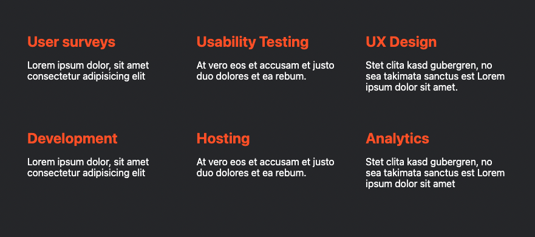

# Challenges: CSS Grid

## Grid Games

Master this Grid Game:

- [Grid Garden](https://cssgridgarden.com/)

This one is an optional home work:

- [Grid Attack](https://codingfantasy.com/games/css-grid-attack/play)

> 💡 Both games provide you with useful information for the following challenges.

## Grid Challenges

Solve the following Grid Challenges

> 💡 Not all challenges have to be solved during session time. Use the remaining challenges as
> practice for your independent learning time after class.

### [Image Gallery Challenge](https://codesandbox.io/s/github/neuefische/web-exercises/tree/main/sessions/css-grid/image-gallery?file=/css/styles.css)

### [Service Gallery Challenge](https://codesandbox.io/s/github/neuefische/web-exercises/tree/main/sessions/css-grid/service-gallery?file=/css/styles.css)

### [Payment Cards Challenge](https://codesandbox.io/s/github/neuefische/web-exercises/tree/main/sessions/css-grid/payment-cards?file=/css/styles.css)

### [Fishes Cards Challenge](https://codesandbox.io/s/github/neuefische/web-exercises/tree/main/sessions/css-grid/fishes-cards)

### [Place The Elements Challenge](https://codesandbox.io/s/github/neuefische/web-exercises/tree/main/sessions/css-grid/place-elements?file=/css/styles.css)

