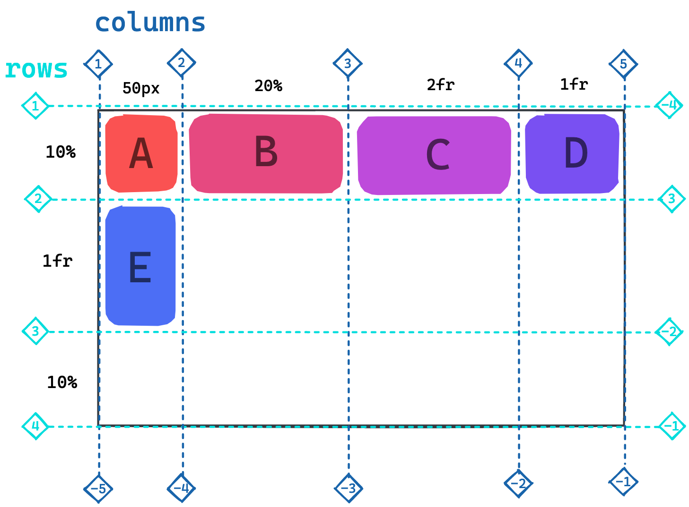
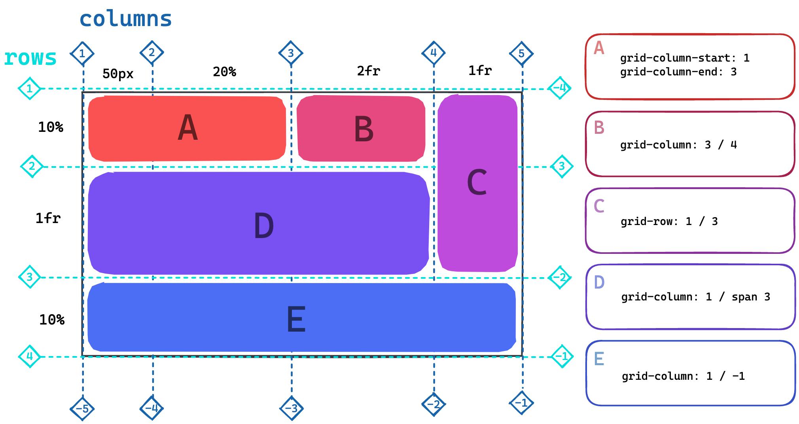

# CSS Grid

## Learning Objectives

In this session you learn:

- [ ] what css grid is and how to use it
- [ ] how to position grid cells
- [ ] how to align cells

---

## CSS Grid

With CSS grid, you can position html elements in a grid structure, reposition individual elements,
stretch items across multiple cells and much more. it is a very powerful layout tool.

Working with CSS grid contains two major parts:

1. defining the layout on a container element
1. positioning the children on the grid cells

## Grid Layout

Just like CSS flexbox, the layout is defined on a container element which holds all elements which
will be positioned in the grid.

```css
.container {
	display: grid;
}
```

The grid is then defined by the number and size of it's rows and columns. By default, the grid
consists of one column. The properties for defining the columns and rows are `grid-template-columns`
and `grid-template-rows`

| Property                | Effect                                                                                                                                                       |
| ----------------------- | ------------------------------------------------------------------------------------------------------------------------------------------------------------ |
| `grid-template-columns` | Sets the layout of the grid columns by defining the width of each column. Example: `30px 200px`                                                              |
| `grid-template-rows`    | Sets the layout of the grid rows by defining the height of each row. Example: `10% 500px 10%`                                                                |
| `gap`                   | Sets the gap between columns and rows. Accepts one value for the column gap and on for the row gap. If given only one value both gaps are set to that value. |

## `fr` Unit

The grid layout has a special sizing unit next to px, rem or %: `fr`. This fraction unit works as
follows:

1. it splits the remaining space in a grid into equally sized fractions. The number of these parts
   is determined by the total amount of fraction units distributed in the row/column template.
2. The individual rows / columns then take up the assigned number of fractions.

In the following picture, the last two columns are sized with fraction units. The first of them has
twice the width than the second one.


## Element Positioning

After the grid is set up on the container element, its children are placed inside the grid cells
from left to right, top to bottom. By default, the elements are stretched such that they take up all
the available cell space.



Elements can be stretched over multiple cells by using element positioning properties. Each element
can be set on the columns and rows by using:

1. `Column / row index` (see picture above).
2. Negative `index`. Indexing the lines from the other side.
3. The `span` value. Defines how many cells the item should stretch across.

| Property      | Effect                                                                                                                                            |
| ------------- | ------------------------------------------------------------------------------------------------------------------------------------------------- |
| `grid-column` | Takes two values separated by a '/' defining the starting and ending column line. Can also be defined by `grid-column-start` / `grid-column-end`. |
| `grid-row`    | Takes two values separated by a '/' defining the starting and ending row line. Can also be defined by `grid-row-start` / `grid-row-end`.          |
| `grid-area`   | Takes 4 values separated by '/' defining the starting and ending row and column lines. Combines `grid-column` and `grid-rows`.                    |



> ❗️ Positioning properties are set on the child elements, not on the container!

## Cell Aligning

The distribution of columns / rows and the position of the elements _inside_ their cells can be
specified on the grid container.

| Property          | Effect                                                                                                                   |
| ----------------- | ------------------------------------------------------------------------------------------------------------------------ |
| `justify-content` | Sets the alignment of the `columns`, e.g. start, center, space-evenly.                                                   |
| `align-content`   | Sets the alignment of the `rows`, e.g. start, center, space-evenly.                                                      |
| `place-content`   | Sets the alignment of the `rows` and `columns`, can take two values, e.g. start, center, space-evenly.                   |
| `justify-items`   | Sets the `horizontal` alignment of elements inside their cell, e.g. start, center, end. Default: stretch.                |
| `align-items`     | Sets the `vertical` alignment of elements inside their cell, e.g. start, center, end. Default: stretch.                  |
| `place-items`     | Sets the `vertical` and `horizontal` alignment of elements inside their cell, e.g. start, center, end. Default: stretch. |

> 💡 This [complete guide to css grid](https://css-tricks.com/snippets/css/complete-guide-grid/)
> covers everything you need to know about the grid property.

---

# Challenges

## Part 1

## Part 2

---

## Resources

- [Complete Guide to CSS Grid](https://css-tricks.com/snippets/css/complete-guide-grid/)
