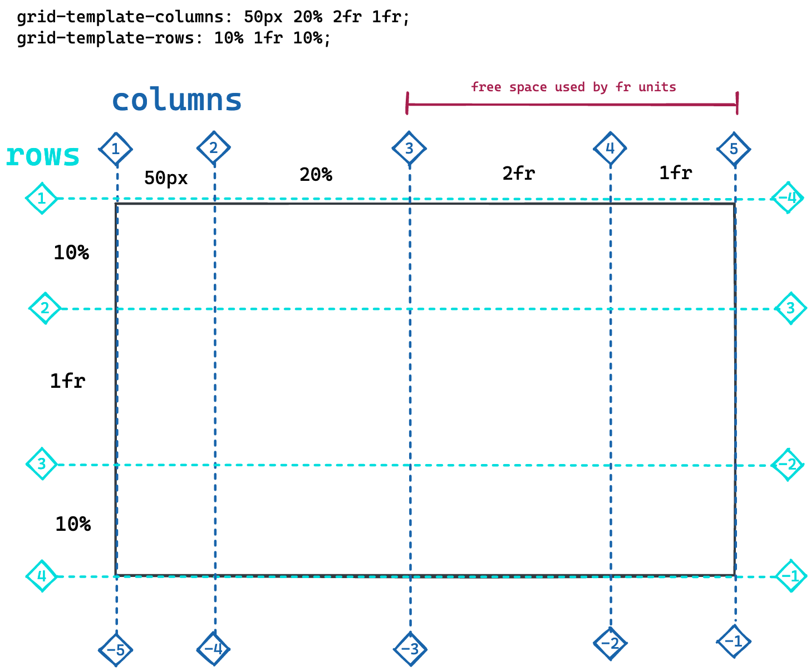

# CSS Grid

## Learning Objectives

In this session you will learn:

- [ ] what css grid is and how to use it
- [ ] how to position grid cells
- [ ] how to align cells

---

## CSS Grid

With CSS grid, you can position html elements in a grid structure, reposition individual elements,
stretch items across multiple cells and much more. it is a very powerful layout tool.

Working with CSS grid contains two major parts:

1. defining the layout
1. positioning the cells in the grid

## Grid Layout

Just like CSS flexbox, the layout is defined on a container element which holds all elements which
will be positioned in the grid.

```css
.container {
	display: grid;
}
```

The grid is then defined by the number and size of it's rows and columns. By default, the grid
consists of one column. The properties for defining the columns and rows are `grid-template-columns`
and `grid-template-rows`

| Property                | Effect                                                                                                                                                       |
| ----------------------- | ------------------------------------------------------------------------------------------------------------------------------------------------------------ |
| `grid-template-columns` | Sets the layout of the grid columns by defining the width of each column. Example: `30px 200px`                                                              |
| `grid-template-rows`    | Sets the layout of the grid rows by defining the height of each row. Example: `10% 500px 10%`                                                                |
| `gap`                   | Sets the gap between columns and rows. Accepts one value for the column gap and on for the row gap. If given only one value both gaps are set to that value. |

The grid layout has a special sizing unit next to px, rem or %: `fr`. This fraction unit works as
follows:

1. it splits the remaining space in a grid into equally sized fractions. The number of these parts
   is determined by the total amount of fraction units distributed in the row/column template.
2. The individual rows / grids then take up the assigned number of fractions.

In the following picture the last two columns are sized with fraction units. The first of them has
twice the width than the second one.



## Cell Positioning

The elements are then inserted into the cells from left to right, starting a new row if the last one
is filled up.

## Cell Aligning

## `Auto-Fill` and `Minmax`

---

# Challenges

## Part 1

## Part 2

---

## Resources

- [Complete Guide to CSS Grid](https://css-tricks.com/snippets/css/complete-guide-grid/)
