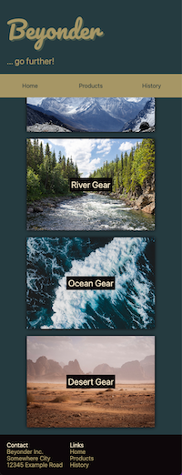
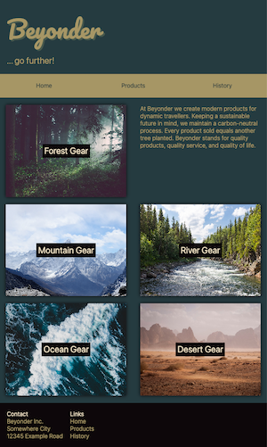
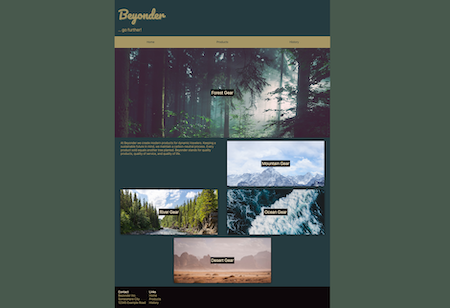

# Challenges: CSS Responsive

## Part 1: Playground

In this challenge you'll get to play around a bit with some responsive features such as relative
units and different types of media queries.

- open this
  [CodeSandbox](https://codesandbox.io/s/github/neuefische/web-exercises/tree/main/sessions/css-responsive/playground)
- take a look at the requirements stated as part of each mini-challenge.

> ❗️ Make sure to read the instructions carefully!

## Part 2: Responsive Website

This challenges revolves around making a website responsive via media queries and breakpoints.

- open this
  [CodeSandbox](https://codesandbox.io/s/github/neuefische/web-exercises/tree/main/sessions/css-responsive/responsive-website)
- familiarize yourself with the `index.html` and `styles.css` files.

Here are some preview screens that (hopefully) help you get an idea of what needs to be done.

> 💡 Hint: You will only need to create media queries for two breakpoints.

#### Mobile Screens

 

#### Tablet Screen

#### Desktop Screen

