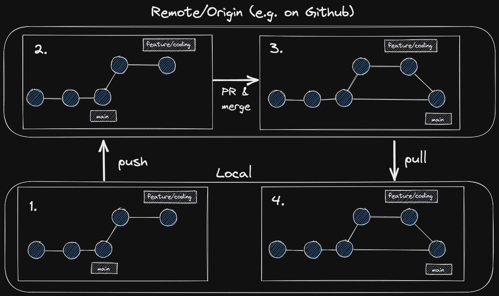

# Git Branches & PRs

> 💡 feel free to create a personal branch of this guide to add your own notes

## Learning objectives

- [ ] why the following concepts are important for collaboration.
- [ ] what git branches are and how to use them.
- [ ] what Pull Requests are and how to use them.

---

## Arrival: Motivate students and prepare them for the topic

> 💡 Breathe and relax :)

### Which important problem will we solve today?

- Working on the main branch is dangerous, since you might introduce a bug into the production
  version of your application
- A save workflow is needed where features can be developed and tested without breaking the main
  version of the application
- This workflow is git feature branches

### Why is the content of todays block so important for the students?

- using git branches full potential is mandatory if you want to work in the industry

---

## Activate prior knowledge of students

### Which prior knowledge will be used for this session?

- [ ] git commits
- [ ] git repositories
- [ ] pushing to main branch

---

## Inform: Sessionguide

### Git Branches

- [ ] give an example where working with different versions of an application is very useful
- [ ] sketch how git branches work 

- [ ] highlight, that creating a new branch does not copy the whole git history, but creates just a
      new label for the current commit
- [ ] show how to create a new branch

  - [ ] `git branch <branch name>` / `git switch -c <branch name>`
  - [ ] `git checkout <branch name>` / `git switch <branch name>`

- [ ] create some commits on the feature branch
- [ ] show how you can now switch between different versions of the code by switching branches
- [ ] highlight, that students can always create a test branch if they want to try out ideas in a
      save environment

### Git Pull Requests

- [ ]
- [ ]

### Git Feature Branch Workflow

- [ ] show the students how the basic git feature branch workflow works
      
  - [ ] create git feature branch and work on the code
  - [ ] push the result to a new remote feature branch
  - [ ] `git push -u origin <feature branch name>`
  - [ ] create a Pull Request and merge the

---

## Process: Project / Assignment

- [ ] Provide the [handout](git-branches-and-prs.md) for the students
- [ ] Open the handout and walk the students through the tasks
- [ ] Divide the students in groups
- [ ] Remind them of the ground rules (Meet again 30min before lunchbreak in the classroom / They
      can ask the coaches for help at any time / Always help each other / Take a break when you need
      it in the next 1.5h/ Keep an eye on Slack)

---

## Evaluate: Recap of the assignment / Discussion of MVP / Solution

- Come back to the question that was raised in the beginning od the session and try and answer it in
  a few phrases.

---

## Checkout

> 💡 In case the students seem frustrated try to find some encouraging words (e.g. remind them of
> how far they have come already) :)

- [ ] Summarize the day by repeating all the topics that were discussed
- [ ] Highlight the progress of the day
- [ ] Encourage the students to repeat what they learned with practical exercises
- [ ] Remind them to rest :)

## Keywords for Recap:

> These keywords are for the weekly summary on Fridays. We use the keywords to automatically
> generate excalidraw tags with the help of
> [this amazing tool](https://github.com/F-Kirchhoff/tag-cloud-generator). The students structure
> the cards in a pattern that makes sense for them. Each tag, that is added to the structure needs
> to be explained in a few words by one student. We go in rounds one by one until all tags are
> included in the structure.
