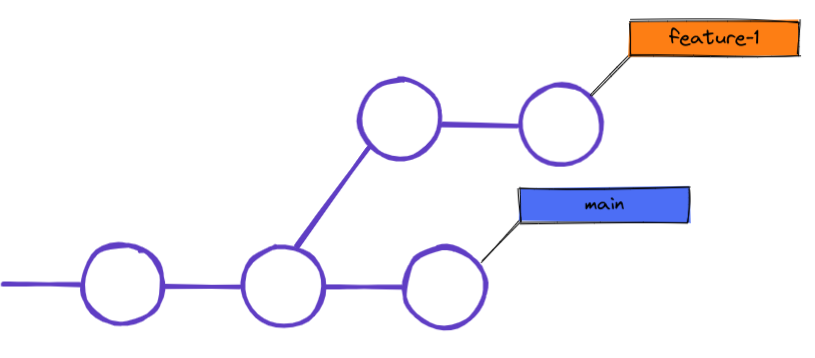
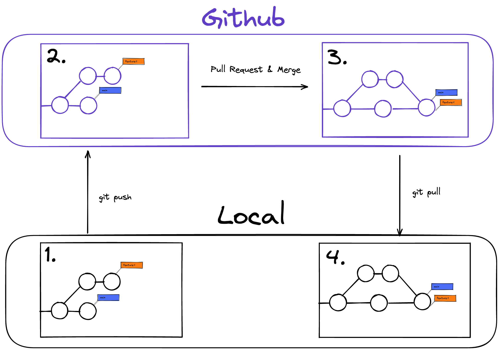

# Git Branches & PRs

## Learning Objectives

In this session you will learn:

- [ ] what git branches are and how to use them.
- [ ] what Pull Requests are and how to use them.
- [ ] how branches and pull requests facilitate collaboration.

---

## Git Branches

Imagine a team member works on a feature and introduces a bug which would keep everyone else from
testing their own work. That would be inefficient and keep everyone else from doing their job.

When working on a project, especially as a team, you want to work on features independently, so they
never affect anyone else's work. Git offers us `branches` to keep our current work away from a teams
common codebase until completion.

A `branch` lets you split from the main line of development. The new branch shares a part of its
commit history with the main branch. At a certain commit the new branch branches off and the commit
histories differ.

The teams common codebase is typically kept in the `main` branch. If you work on a new feature you
create a new `feature branch` and work on that new branch. You commit your work on the new branch
and the main branch is not effected. You can finish work on the new feature, test the new
functionality and have other developers review your work. In the end you `merge` your feature branch
into the main branch, so all your work and commits of the new feature are included in the main
branch.

## Naming branches

Each branch in git has a name. The common codebase is typically kept in the `main` branch. It is
good practice to use short descriptive names for your feature branches, e.g. `contact-form` if your
new feature is a contact form in your website. We recommend using hyphens as separators as they make
the name more comfortable to read.

### Git `branch` commands

| command                        | functionality                                 |
| ------------------------------ | --------------------------------------------- |
| `git branch`                   | list your branches                            |
| `git branch -a`                | list all branches (local and remote)          |
| `git branch <branchname>`      | create a new branch                           |
| `git branch -d <branchname>`   | delete the branch                             |
| `git switch -c <branchname>`   | create a new branch with the switch command   |
| `git checkout -b <branchname>` | create a new branch with the checkout command |
| `git switch <branchname>`      | switch to that branch                         |
| `git checkout <branchname>`    | another way to switch branch                  |

## Git Pull Requests

It is important for developers to maintain high code quality and to have other developers review
their work. Git offers us `pull requests` which we can use as a convenient way to request reviews of
the work on a `feature branch`. A pull request is a request to `merge` one branch into another
branch. We can create a pull request on GitHub and ask other developers to review all changes made
in the respective feature branch. The reviewers can comment on the changes, request further changes
to be made or approve the pull request. If a pull request is approved we can merge the feature
branch into the main branch.

### Basic Workflow for a Pull Request

1. Create a new branch with `git branch <branchname>`
2. Make changes to the code / write your code fpr the feature
3. Push the changes and the new branch with `git push -u origin <branchname>` (after you have done
   this once you can use `git push` for this branch)
4. Create a pull request on GitHub from the new branch into `main`
5. Share the pull request with your team
6. Review the pull request, implement changes if needed, push again to update the pull request until
   it gets approved
7. Merge the pull request into `main`
8. Don't forget to `git pull` inside the `main` branch on your local machine
9. Delete the new branch on GitHub and locally

---

## Resources

- [About branches](https://docs.github.com/en/pull-requests/collaborating-with-pull-requests/proposing-changes-to-your-work-with-pull-requests/about-branches)
- [Git Branching - Branches in a Nutshell](https://git-scm.com/book/en/v2/Git-Branching-Branches-in-a-Nutshell)
