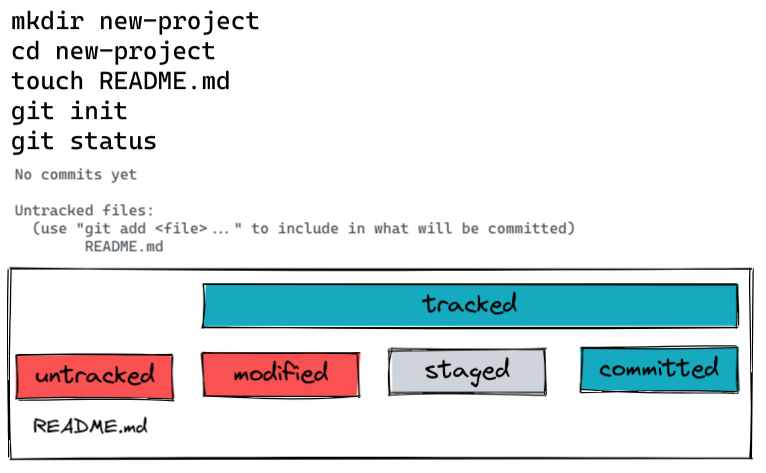

# Git CLI and Remote

> 💡 feel free to create a personal branch of this guide to add your own notes

## Learning objectives

- [ ] to use version control locally to create repositories and commits.
- [ ] understanding and controlling the `different states` of files.
- [ ] to synchronize local repositories with remote repositories (on GitHub for example).

---

## Arrival: Motivate students and prepare them for the topic

> 💡 Breathe and relax :)

### Which important problem will we solve today?

- You will learn today one of the most important tools you will need in your development career.
- How return to the latest version of a project / file when something goes wrong.
- You will learn how to share your code with the world on GitHub.

### Why is the content of todays block so important for the students?

- git is an industry standard, it is a requirement for most almost all open positions as a
  developer.
- git helps the students when they accidentally mess up their code, so they can always go back to
  the last save point

---

## Activate prior knowledge of students

- recap what the students learned in their first session `GitHub and Markdown`
- ask them about
  - commits
  - repositories
  - git workflow (creating commits after each important step)
- tell the students that they will learn today how to do these steps on their local machine and
  connect their progress to the remote version of their code on github

### Which prior knowledge will be used for this session?

- git terminology (repository, commit)
- basic markdown syntax (later in the challenges)

---

## Inform: Sessionguide

### Git init

**1. Show how to initialize a git repository.**

- [ ] `mkdir new-project` - create a new folder
- [ ] `cd new-project` - go into the new folder
- [ ] `git init` - turning the folder into a local repository
- [ ] show that the folder becomes a repository through the hidden .git folder
- [ ] show that you can delete the repository by deleting the folder
- [ ] create a `.gitignore` file and add `.DS_Store` to the file. Explain that inside the DS_Store
      file are listed display configurations by macOS, that are not interesting for our remote
      repository. This is why we want git to ignore it.
- [ ] explain that everything we add to the `.gitignore` file will not be commited to our remote
      repository

### Git commit

**1. Explain the different states a file inside a repository can be in.**

- [ ] untracked - a file has never been part of a commit and therefore is not a part of the
      repository yet.
- [ ] modified - a file is tracked by git but has changed since the last commit
- [ ] staged - the changes in the file are prepared to become part of the next commit (it is put
      onto a stage with other changes to take a snapshot of everything on that stage later).
- [ ] committed - the file / changes have become part of the commit. Untracked files become part of
      the repository and will be tracked from now on.

**2. Show how to commit changes made to a file in the repository.**

- [ ] `git status` - see what the current state of the files in your repository are
- [ ] `git add file` - put the changed file on the stage
- [ ] `git status`
- [ ] `git commit -m 'Commit message'` - create a new savepoint including every change on the stage
- [ ] `git status`
- [ ] `git log --oneline` - show the latest git history

**3. Show how to return to the latest version of a file if something goes wrong. (why whe use git in
the first place)**

- [ ] create some more commits (add some more content to the file you are working on)
- [ ] now simulate an massive error, e.g. deleting the content of a file and save it.
- [ ] `git status` - you will see the untracked changes
- [ ] `git restore <file name>` - reset the file to the last committed state.
- [ ] `git restore .` show that you can reset the whole repository to the state of the last commit
      if necessary.

### Git remote repositories

**1. Show how students can connect a remote repository to their local repository.**

- [ ] mention that the ssh connection needs to be setup, which we will do later in the session.
- [ ] For now they just need to watch and try to understand the necessary steps.

on GitHub:

- [ ] on github - create a new repository without a README.md
- [ ] copy the ssh link

inside the local repository:

- [ ] `git remote -v` looking which remote repositories are already connected - none of course
- [ ] `git remote add origin <ssh link>` - adding our new GitHub repository to the remote
      repositories under the name `origin`
- [ ] explain that one local repository can have multiple remote repositories, therefore they need a
      name to distinguish them.
- [ ] `git remote -v` showing that our repository shows up in the remote repository list
- [ ] `git push -u origin main` - pushing all commits to the remote repository, highlight that -u
      origin main is only necessary when pushing for the first time

**1. Show how to clone an existing repository to the local machine.**

on GitHub:

- [ ] copy the ssh key of the repository

in the terminal, outside of any other repository:

- [ ] `git clone <ssh link>` - a new folder gets created containing the cloned repository.
- [ ] point out that a new folder gets created when cloning a repository, and that you should not
      cloning a repository while being in another repository.
- [ ] when using this command the local repository will be named exactly like the remote repository

### SSH configuration

**Guide the students through the ssh configuration.**

- [ ] let them install the `git cli` via brew: `brew install gh`
- [ ] let them execute the `git ssh script`: `<insert link to script here :)>`
- [ ] make sure the students fill in the prompts of the script correctly (correct mail used on
      GitHub and username).

---

## Process: Challenges

- [ ] Provide the [handout](session-name.md) for the students
- [ ] Open the handout and walk the students through the tasks
- [ ] Divide the students in groups of 2 - 3
- [ ] Remind them of the ground rules (Meet again 30min before lunchbreak in the classroom / They
      can ask the coaches for help at any time / Always help each other / Take a break when you need
      it in the next 1.5h/ Keep an eye on Slack)

---

## Evaluate: Recap of the assignment / Discussion of MVP / Solution

- [ ] Ask the students how easy or difficult this workflow was for them
- [ ] If it was difficult you can calm them and say that we will do it so many times during the
      bootcamp that they will dream of the git workflow.
  > - [ ] Optional if you feel like they need a compact, visual overview:   Let the students
  >       repeat the whole workflow and write the keywords and commands in an excalidraw.

---

## Checkout

- [ ] Summarize the day by repeating all the topics that were discussed
- [ ] Highlight the progress of the day
- [ ] Encourage the students to repeat what they learned with practical exercises
- [ ] Remind them to rest (preferably sleep) after -latest- 10 p.m.:)

## Keywords for Recap:

git add ., git commit -m "cmsg", git status, git push, git restore ., ssh key, stage untracked
files, committed files,

> These keywords are for the weekly summary on Fridays. We use the keywords to automatically
> generate excalidraw tags with the help of
> [this amazing tool](https://github.com/F-Kirchhoff/tag-cloud-generator). The students structure
> the cards in a pattern that makes sense for them. Each tag, that is added to the structure needs
> to be explained in a few words by one student. We go in rounds one by one until all tags are
> included in the structure.
