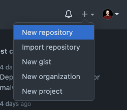

# Challenges: Git CLI and Remote

At the end of these challenges, we will have transformed some of the folders inside `web-bootcamp` into git repositories. It should look something like this:

```bash
~
|- web-bootcamp (normal folder)
   |- web-challenges (git repository)
   |- session-notebook (git repository)
   |- personal-website (git repository)
|- ...
```

It's important that we do NOT nest git repositories inside each other, meaning that `web-bootcamp` should remain an ordinary folder. Please make sure that you never use the command `git init` when you are located in the `web-bootcamp` folder.

## Upload Web Challenges

(difficulty: 🔥)

Our `web-challenges` folder should become a git repository so that we can upload our progress. Let's do that right now!

- Inside `web-challenges`, turn the folder into a git repository with the command `git init`.
- Create a new empty remote repository also called `web-challenges` in your Github account.
- Copy the SSH repository address, e.g., `git@github.com:<your-github-name>/web-challenges.git`, and add it as the remote repository "origin" to our local `web-challenges` repository (a repository can be linked to multiple remote repositories, so we need to give them nicknames to distinguish them; "origin" is the standard name for the main remote repository):
  ```bash
  git remote add origin <ssh link>
  ```
- Check if the remote repository was successfully linked with the command:
  ```bash
  git remote -v
  ```
  A "fetch" and a "push" address should be printed to the terminal.

For every challenge in your `web-challenges` repository:

- Use `git add <challenge folder name>` to stage the changes from this challenge.
- Commit these challenge files with `git commit -m "<message>"` and add a meaningful message, e.g., "add solution for html and the web - personal website".
- Use `git push` to push the new commit to your remote repository on GitHub. The first time you need to specify where you want to push to with the command `git push -u origin main`.
- Repeat this for every challenge folder!

## Upload the Personal Website

(difficulty: 🔥)

Lets upload our personal website as well!

- Go to your **personal website** project folder and turn the folder into a git repository with `git init`.
- Make sure that the personal website folder is **not** nested inside the `web-challenges`; otherwise, you would create a nested git repository inside another git repository, which is tricky to handle.
- Commit everything in this folder the same way you did in the prior challenge.
- Go to Github and create a new **empty** repository called "personal-website" (no README, no license).
- Copy the SSH repository address and add it as the "origin" repository to your local repository:
  ```bash
  git remote add origin <ssh-repository-address>
  ```
- Push your commit to the remote repository by using:
  ```bash
  git push -u origin main
  ```
- Reload the GitHub repository page and check if the code for your personal website is now online.

## Session Notebook Part 1

(difficulty: 🔥)

In this project, you will start filling the already prepared `session-notebook` for all your upcoming session notes. In this part, you will create the folder structure and markdown files. Later, we will fill these files with actual content.

> ❗️ You may only use the terminal for these tasks!

1. Go inside your already created `session-notebook` folder.
2. Create a `README.md` in this folder; we will use it later to link to other markdown files.
3. Inside this folder, create multiple folders, e.g., `shell-and-git`, `html`, `css`, `javascript`.
4. Create a markdown file for each session we have had so far. Make sure they are created in the correct folder.
5. You could also create a `git-cheatsheet.md` file, where you collect all your git commands.

### Connect the Session Notebook to GitHub

You already created a folder and file structure for your session notes. Now, we want to connect the `session-notebook` to your GitHub account as a repository. Therefore we need to connect the local repository to a remote repository.

#### Part 1

The first step is to initialize a new repository based on the folder you created for the session notes.

1. If not already done, navigate through the shell to the `session-notebook` folder you created for the session notes.
2. Run the git command to initialize a new local git repository.
3. Create your first commit.

> 💡 After initializing, you should get a message like this:
>
> ```
> Initialized empty Git repository in /Users/<your-username>/<path_to_folder>/session-notebook/.git/
> ```

#### Part 2

Next, create a new repository on GitHub and connect your local repository to the remote repository.



1.  Open GitHub and create a new repository.
2.  Make sure it's a **public repository** and uncheck "Add a README file" since we already created one.
3.  Connect this repository with your local one the same way we did in the previous challenges.

#### Part 3

From now on, you can push your local changes to the remote repository. Lets try this out!

1. Create a new file in the `shell-and-git` folder and note down the process to create a new remote repository.
2. **Commit** your changes (make multiple commits).
3. **Push** your changes to the remote repository and look at the GitHub repository page to see your updates.

> ❗️ Commit after each step with a meaningful commit message.

> 💡 Hint: You can see the commit history on GitHub.
