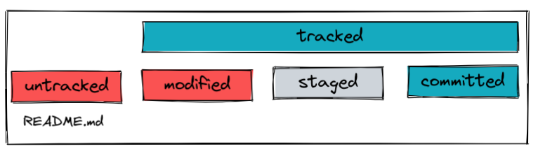

# Git CLI & remote

## Learning Objectives

In this session you will learn:

- [ ] to use version control locally to create repositories and commits.
- [ ] about the `different states` of files.
- [ ] to synchronize local repositories with remote repositories (on GitHub for example).

---

## Git CLI

You have installed the Git Software on your machine. That means you can create repositories and
commits on your own machine. You can also synchronize your local repository with a
`remote repository` which can be on GitHub for example. We interact with git over the terminal using
git commands which you will learn today.

### Creating local repositories

You can turn any folder in your file system into a `local git repository`. That means that git will
track all changes to files we make in that folder. We will create a folder for each of your projects
and every one of those folders / projects will be a git repository. To turn a folder into a git
repository you need your first git command:

| Git command | Git task                          |
| ----------- | --------------------------------- |
| `git init`  | create a new local git repository |

> ❗️ Do not initialize a git repository inside another git repository!

In your terminal you can navigate into any folder in your file system and use the `git init` command
to turn that folder into a local repository. Git will create a hidden `.git folder` in the project
folder. This hidden folder contains all the information about the repository and its commit history.
Never touch or modify anything in that folder.

### States of files

If we have a repository on GitHub we can create / modify / delete files. Through a few button clicks
we create a commit which contains all the changes we have made. We can do the same thing through our
terminal with local repositories. To understand how this happens we have to know about the different
states a file can be in.

- Tracked files: Tracked files are files that git knows about. All tracked files were in the last
  snapshot. Tracked files can be in different states:

  - modified: A file is modified when it has changed since the last commit.
  - staged: A file is staged when we told git to include the changes in the next commit. One way to
    think of it is as if the files were entering a literal stage - waiting for the snapshot to be
    taken (waiting to be committed).
  - committed: A file is in the committed state when it has not changed since the last commit.

- Untracked files: Untracked files are files that are not in the latest snapshot and have not been
  staged. Git does not yet keep track of those files.

We will go through an example of different states a file can be in in the following section.

### Committing in a local repository

To understand the workflow with git, we want to visualize the process with the following example:

We will use the following git commands to go through an example of how to take a file through the
different states and put it into a commit:

| Git command                      | Git task                                         |
| -------------------------------- | ------------------------------------------------ |
| `git status`                     | list all files that have changed and their state |
| `git add <filename>`             | add a file to the staging area                   |
| `git commit -m "commit message"` | create a commit including all staged files       |
| `git log --oneline`              | show a list of commits starting with the latest  |

Say we have a folder containing an empty README.md file and nothing else. We can turn that folder
into a git repository using `git init`. That folder is now a git repository but it has no commits
and therefore an empty commit history.

If we run the command `git status` we get a message like this:

```
No commits yet

Untracked files:
  (use "git add <file>..." to include in what will be committed)
	README.md
```

The README.md is now untracked:



We can put untracked files into the staging area. That tells git to include them in the next commit.
We can do this by typing `git add README.md`. If we then run `git status` again we get the following
message:

```
No commits yet

Changes to be committed:
  (use "git rm --cached <file>..." to unstage)
	new file:   README.md
```

The README.md is now staged:


We can now create the first commit with a descriptive commit message by typing
`git commit -m "add readme without content"` If we run `git status` now we get the following
message:

```
On branch main
nothing to commit, working tree clean
```

The README.md is now committed:


## Using commits as backups

When you accidentally introduce a bug into your code or delete some important parts of your project,
you can always return to the last committed state of the project:

```sh
git restore .
```

This command resets your whole project to the version saved in the last commit. You can also restore
individual files:

```sh
git restore <file name>
```

> 💡 Hint: Commits are a powerful tool when it comes to backup your progress. Commit often an make
> sure your code works as expected when you do.

## Connecting to a remote repository

We want to connect our local repository with a remote repository which can be on GitHub for example.
This enables whole teams to work on the same `remote repository` and create copies or
`local repositories`. The remote repository also serves as a backup in case your hard drive breaks.

### Connecting your local repository to a new remote repository

If you have a local repository and want to create a new remote repository on GitHub, the first thing
you need to do is to create a new empty remote repository on GitHub. After creating the repository
on GitHub, we can see some hints and can follow the hints saying "...or push an existing repository
from the command line". You can copy the commands from GitHub and execute them in your local project
folder. The commands should look similar to the following:

```
git remote add origin git@github.com:GitHubUsername/repository-name.git
git branch -M main
git push -u origin main
```

The first command tells git to add a new remote repository and remember it under the name "origin".

The second command renames the branch that you are working on to "main". You don't have to
understand what branches are - we will go over that in a future session. This command is only
relevant if you use older versions of git.

The third command pushes your local commits to the remote repository. After executing this command
you can refresh the GitHub page in your browser and you will see that the remote repository contains
all the commits of your local repository.

### Cloning a remote repository

If you want to work locally on a remote repository that you don't have a local version of on your
own machine, you can clone the remote repository. That means you get a copy of the repository on
your local machine. You clone a repository using the `git clone` command:

| Git command       | Git task                                     |
| ----------------- | -------------------------------------------- |
| `git clone <url>` | create a working copy of a remote repository |

You can find the url of remote repositories on GitHub on the repository page under "Code". You
should use the SSH url to clone repositories. After cloning the repository you will have a folder
with the repository name on your local machine. This folder contains all project files and the
hidden `.git folder` which contains the commit history of the repository.

### Synchronizing local & remote repositories

Different people can work on the same remote repository. They will clone the repository and create
commits on their local repositories. They have to synchronize the remote repository with the local
repositories. If you created new commits locally on your own machine, you have to use `git push` to
push these new commits to the remote repository. If the remote repository contains new commits that
your local repository doesn't know anything about, you have to use `git pull` to pull the new
commits from the remote repository.

| Git command | Git task                                                                    |
| ----------- | --------------------------------------------------------------------------- |
| `git push`  | send content to the remote repository                                       |
| `git pull`  | download content from the remote repository and update the local repository |

Let's look at an example: Say you want to work on a website with your friend.

1. Your friend has already started and created a Homepage for your website. He created a repository
   on GitHub which contains all his work (commits).
2. You cloned the repository.
3. You worked on the website on your own machine. Say you added a second page - a Contact Page for
   example. You made a few new commits for the new page on your local repository.
4. If you look at the repository page on GitHub, it looks just like before - no sign of your newly
   created Contact Page. That is because the remote repository doesn't know that you made a few new
   commits on your local machine.
5. You have to use `git push`. After executing this command you can refresh the GitHub repository
   page and you will then see the changes you made and the Contact Page you created.
6. Your friend probably has a local repository. This local repository doesn't contain your work.
   Your friend has to execute the `git pull` command. After executing this command his local
   repository will contain the new commits and he will see the Contact Page.

---

## Setup Visual Studio Code

There are plenty of editors available on the internet. In general you can use any of them to edit
your code. Even with the regular MacOS TextEdit App, you could write code. But that's not very
convenient because code editors give us useful functions. Also we want to guarantee that all Coaches
and Students can help each other. Therefore we are all using one of the most popular editors:
[Visual Studio Code](https://code.visualstudio.com/). This editor from Microsoft is a free, open
source and available for all platforms, even on the browser, e.g. on GitHub.

Normally you would go to the website and download the software. But as you may already know, we can
use `Homebrew` to install things we need.

```shell
brew install --cask visual-studio-code
```

You can find more details on this installation here:
[visual-studio-code — Homebrew Formulae](https://formulae.brew.sh/cask/visual-studio-code)

---

## Setup SSH Key

In order to communicate safely between your local machine and GitHub, we use a protocoll called
`SSH` (Secure Shell). This protocoll allows you to connect to GitHub and authenticate yourself
without using your username and password every time.

Therefore we generate a `SSH key` on your local machine and add it to GitHub. These steps are
necessary once on every machine you want to work with.

#### Step 1: GitHub CLI

Install the GitHub command-line tool via Homebrew:

```
brew install gh
```

#### Step 2: Git config and SSH key

We created a script for you to easily set your git config, generate a SSH key and add it to GitHub.
Follow the instructions in your Terminal.

- Pleaser enter the requested inputs
- Press `Enter` (default) when asked about which file to save the key and your passphrase (leave it
  empty).
- Choose `ssh` as your preferred connection method when asked.
- Login and authenticate with the browser. (The device code is found in the Terminal.)

```
zsh <(curl -s https://raw.githubusercontent.com/neuefische/zsh-setup/main/setup-git-and-ssh)
```

---

# Challenges

## Session Notebook

In this project you will create a markdown based notebook for all your upcoming session notes. In
this part you will create the folder structure and markdown files, in a future part we will fill up
these files with actual content.

> ❗️ You may only use the terminal for these tasks!

1. Create a folder called `session-notebook`.
2. Create a README.md in this folder, we will use it later to link to the other markdown files.
3. Inside this folder, create multiple folders, e.g. `shell-and-git`,`html`, `css`, `javascript`.
4. Create a markdown file for each session we had so far. Make sure they are created in the correct
   folder.
5. You could also create a `git-cheatsheet.md` file, where you collect all your git commands.

## Connect the Session Notebook to GitHub

You already created a folder and file structure for your session notes. Now we want to provide the
`session-notebook` to your GitHub account as a repository. Therefore we need to connect the local
repository with a remote repository.

### Part 1

The first step is to initialize a new repository based on the folder you created for the session
notes.

1. If not already done, navigate through the shell to the folder `session-notebook` you created for
   the session notes.
2. Make sure you have at least a `README.md` and optionally more folders and files. If not, create
   them by using shell commands.
3. Run the git command to initialize a new local git repository.
4. Create your first commit.

> 💡 After initializing you should get a message like this:
>
> ```
> Initialized empty Git repository in /Users/<your-username>/<path_to_folder>/session-notebook/.git/
> ```

### Part 2

For the next step you need to create a new repository on GitHub and connect your local repository
with the remote repository.


1.  Open GitHub and create a new repository.
2.  Make sure it's a `public repository` and uncheck "Add a README file" because we already created
    one.
3.  You should see the heading `…or push an existing repository from the command line`. Follow the
    instructions.

> 💡 Hint: if the name of your branch is already `main`, you don't need to use the command
> `git branch -M main` because this command renames the branch to `main`.

### Part 3

For now on you are able to push your local changes to the remote repository.

1. Create new files, add new content to them, remove content, etc.
2. `Commit` your changes. (Make multiple commits)
3. `Push` your changes to the remote repository and look at the GitHub repository page to see your
   changes.

> ❗️ Commit after each step with a good commit message.

> 💡 Hint: you can see the commit history on GitHub.

---

## Resources

- [Connect with SSH Docs on GitHub](https://docs.github.com/en/authentication/connecting-to-github-with-ssh/about-ssh)
