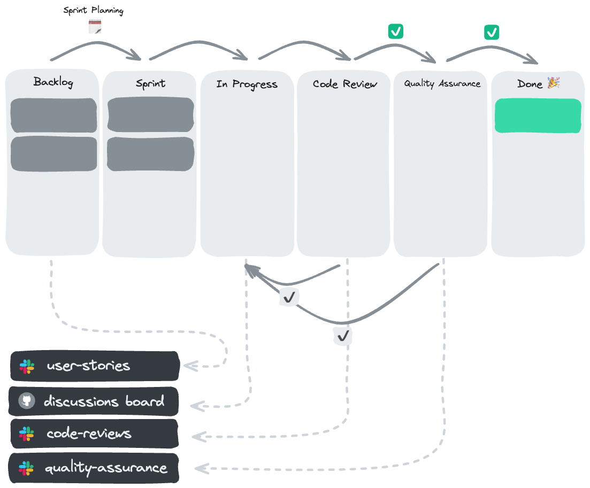

# How to Capstone



## Sprint Preparation & User Story

- Write user story -> move to **Backlog**
- Post to #user-stories
- Review user stories
  **Post reactions**:
  - in review 👀
  - changes requested ✔️
  - approved ✅
  - Coaches Veto 👆
- Changes required? -> Post the user story again after making the changes.

## Implementing a User Story

- Move user story to “In Progress”
- Local repository: switch to `main` -> `git pull`
- Create new branch: e.g. `feature/navigation`
- Small commits
- Check user story **Tasks**
- Check user story **Acceptance Criteria**

## PR & Code-Reviews

- Create pull request
- Needs:
  - Useful title
  - Link back to user story
- Don't add collaborators/assignees/reviewers or message anyone directly
- Post link to PR to #code-reviews
- Move user story to **Code Reviews** column
- Review each other
- _If you're waiting to have your PR reviewed, review a fellow student's PR, etc ..._
  **Post reactions:**
  - in review 👀
  - changes requested ✔️
  - approved ✅
  - coaches veto 👆
- Changes requested? Post the updated PR again after you've implemented the changes.
- Don't merge your PR until it's been through QA.
- Reviews are always done chronologically.

## Quality Assurance (QA)

- Post your deployment (Vercel) to #quality-assurance
- Summarize the feature and expected/desired behavior
- Move user story to the column **Quality Assurance / QA**
  **Post reactions:**
  - in review 👀
  - changes requested ✔️
  - approved ✅
  - Coaches Veto 👆
- Add your feedback to the thread in #quality-assurance
- Changes need to be made? Move the user story back to the column **In Progress**, etc.
- The PR needs to be walked through the stages #code-reviews and #quality-assurance again
- Everything approved? Move the user story to the **Done** column

### After the Quality Assurance Approval

- Now you can merge!
- ... and move on to the next user story!

## Questions & GitHub Discussions Board

If you have a question/a problem:

- Read the documentation,
- try to google the issue,
- or ask your fellow students.
- Search our **[GitHub Discussions Board](https://github.com/orgs/neuefische/discussions)** for similar questions
- Post your question to our **[GitHub Discussions Board](https://github.com/orgs/neuefische/discussions)**:

  - take your time when composing your question and refer to this neat little handout: **[How to ask good questions?](https://github.com/neuefische/questions/wiki/How-to-ask-good-questions)**
  - you have to include: a link to the affected branch / file / line of code.
  - a summary of how you've tried to fix the problem yourself.
  - any error messages as **text**, not as a screenshot.

## Teamwork makes the dream work!

Help each other, keep an eye on the Slack channels, and keep an open mind.
Please follow the process, help out with reviews, QAs and questions.

# How to Review Code

Reviewing code of other students and groups helps you in many different ways:

- You learn how to read code and understand code faster.
- You get in contact with new patterns and ways of how to write code.
- Code reviews can encourage discussions about code and implementation details.

In your job you will read more code from other programmers than writing your own code. Therefore its important to practice this skill with code reviews.

## Code Reviews are Difficult

Reviewing code can be a challenging task at first. It can be overwhelming if you are still uncertain about what is considered good or bad code. Thats ok. You can follow these advice if you feel this way:

- Team up - review code with a peer and discuss the code together.
- Ask questions - you don't understand a specific line of code? Great! Reach out to the author and start a conversation, maybe the code readability can be improved.
- Use the [common issues](#common-issues) collection as a guide.
- Refer to a coach - some PRs are very complex and should be reviewed by a coach. In that case, leave a comment below the #code-review post and let a coach take over.

> 💡 Remember: nobody is perfect - its ok to not find everything.

## Common Issues

This is a non exhaustive list of common issues that appear quite often in code reviews. You can use it as starter guide for your review, please note that there can be other issues not listed below, so keep an open mind while reviewing.

### Variable Naming

```js
// bad
const e = new Error()
const user = [{...},{...}]
const users = {
	id: 1
	name: "Jane"
}
```

```js
// better
const error = new Error() // no abbreviations
const users = [{...},{...}] // plural for arrays
const user = { // singular for single items
	id: 1
	name: "Jane"
}
```

### console.logs

```js
const { data } = userSWR("...");
console.log(data); // remove before creating a PR
```

### Unnecessary Fragments

```js
// bad
return (
  <>
    <Counter />
  </>
);
// only one element is returned, fragments can be removed
```

```js
// better
return <Counter />;

return (
  <>
    <Counter />
    <Counter />
  </>
);
// two elements are returned, therefore a fragment is needed
```

### Inline Styles or CSS Classes

```js
// bad
<button style={{ color: "red" }}>click me</button>
<button className='button'>click me</button>
```

```js
// better
const Button = styled.button`
  color: red;
`;
```

> 💡 CSS classes might be fine for other projects, it depends on which CSS strategy is used in the project. For the capstone projects it is a requirement to use styled components for all styling.

### Readability

```js
// bad
function edit(newU, id) {
  setUsers(users.map((u) => (u.id === id ? newU : u)));
}
```

```js
// better
function handleEditUser(updatedUser, id) {
	const updatedUsers = users.map((user) => {
		if(user.id === id) {
			return updatedUser
		}

		return user
	}

	setUsers(updatedUsers);
}
```

> 💡 What is considered readable and not readable highly depends on the dev team you are working with. This example favors robust naming and structure before conciseness.

### Unnecessary useEffects and useStates

```js
// bad
const [firstName, setFirstName] = useState("John");
const [lastName, setLastName] = useState("Doe");
const [fullName, setFullName] = useState("John Doe");
// this useState is unneeded, the value can be derived from the other two states.

useEffect(() => {
  setFullName(`${firstName} ${lastName}`);
}, [firstName, lastName]);
// this useEffect doubles the number of component renders, and should be avoided.
```

```js
// better
const [firstName, setFirstName] = useState("John");
const [lastName, setLastName] = useState("Doe");
const fullName = `${firstName} ${lastName}`;
```

The `fullName` is directly created based on the two states. If one state changes, the code runs again and therefore `fullName` is recreated as well.
