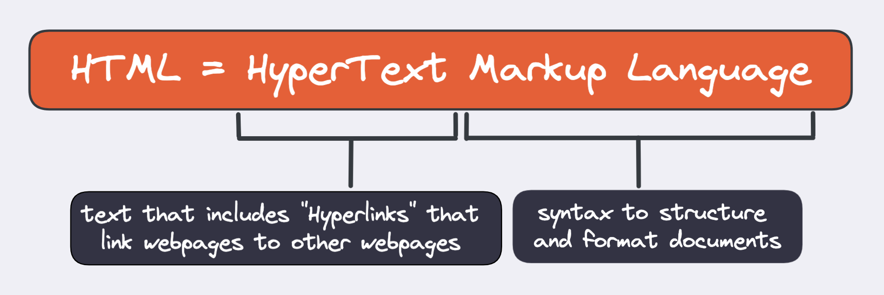
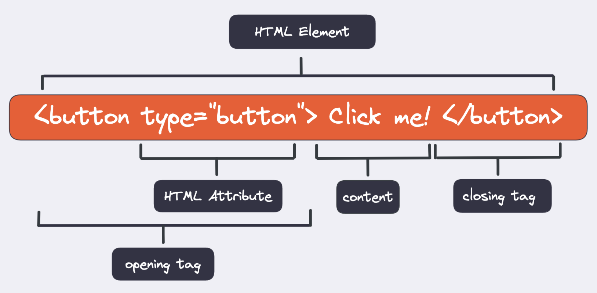

# HTML Basics and the Web

## Learning Objectives

- An answer to "What is the web?"
- How to write HTML
- How HTML documents are structured
- Understanding and applying semantic HTML

## Requirements

none.

## Demo

There is no demo for this session.

---

## Session Guide

> ❗️ Before diving into the depths of HTML, ask the students how many of them already have prior
> knowledge of HTML and how comfortable they are with it. If all of the students have some
> understanding of HTML you can skip or summarize the first part of the session.

### What is HTML?

> 💡 Hint: to visualize this quite theoretical session, use the following keywords and
> [this amazing tool](https://github.com/F-Kirchhoff/tag-cloud-generator) to generate all the
> keywords in an exalidraw and structure them according to your explanation

> `HTML = HyperText Markup Language, link a webpage to another webpage, syntax to structure and format documents, <button type="button">Click me!</button>, HTML Element, HTML Tag, <>, </>, HTML Attribute, <p>Click <strong>this</strong>!<p>), content, opening tag, closing tag, parent element, child element, Empty elements (self-closing), , <link>, <meta>, <input>`

- HTML is short for `HyperText Markup Language`.
- It is not considered a programming language, as `you can't write logic` with it. But nevertheless it is an extremely important part of the internet as we know it today.
- It is giving content on websites `meaning and structure`. You can imagine HTML as the skeleton or the most basic building block of the Web.  
  
 Let's analyze the word for more clarification:

- `Hypertext`: Refers to the ability of HTML to create links that link one webpage to another. (Either on a single website or in between different websites.) This is a fundamental aspect of the web and the idea behind the "world wide" interconnection.

- `Markup Language`: Refers to a syntax that uses specific elements to structure or format a document. You have already learned about a markup language, which is called "Markdown". While Markdown has a very simple syntax and is primarily used for formatting, HTML is more complex and its primarily used to structure a document.

  > Your explanation in excalidraw could look like this:


<br>
<br>

### How to write HTML

- `HTML element`: every piece of content in a HTML document is placed inside of an HTML element
- `HTML tags`: the elements are written in form of HTML tags, meaning surrounded by `<>` and `</>`
- `HTML attributes`: some HTML elements need additional information in order to work properly. This information is given by HTML attributes
- `local attributes`: There are attributes that are specific to some HTML elements, for example `src', which only makes sense if a resource is supposed to be embedded into the webpage (e.g. images or videos)
- `global attributes`: There are also attributes that can be added to any kind of element. (e.g. class, id, style, hidden)

> Your explanation in excalidraw could look like this:


<br>
<br>

### Nesting elements

Two more interesting things to know about HTML:

- it is possible to nest elements in other elements (e.g. `<p>click <strong>this</strong>!<p>`)
- the element inside of another element is called `child element`
- the wrapping element is called `parent element`

### Self-closing elements

- some elements are `empty elements`, which means they contain no content.
- those empty elements are always `self closing elements`, which means they don`t have a closing tag, as they don't need to wrap around content
- examples are images, links, inputs, meta

### The HTML document

- Open VS Code and create an `index.html` file.
- Start with a short explanation of Emmet:

  - `Emmet` is a tool which is already integrated into VS Code. It autocompletes our code, which makes the workflow much faster.
  - By starting to type the name of the element and then clicking `tab`, Emmet does it's magic.

- Type `! tab` and walk the students through the document flow:

```html
<!doctype html>
<html lang="en">
  <head>
    <meta charset="UTF-8" />
    <meta http-equiv="X-UA-Compatible" content="IE=edge" />
    <meta name="viewport" content="width=device-width, initial-scale=1.0" />
    <title>Document</title>
  </head>
  <body></body>
</html>
```

- `<!DOCTYPE html>`: an almost ancient relique of the early HTML (1991/92) that ensures the document behaves correctly
- `<html>`: wraps around the entire content of a page (aka `root element`)
- `<head>`: wraps around every element, which is relevant for your page to function, but which is not content in the sense of visibly showing up on the webpage. (e.g scrips, links, keywords for SEO,...)
- `<meta>`: is an element which provides "metadata" about your document. Metadata is information about the data in your document. (e.g. charset determines the valid characters with are used on the webpage)
- `<title>`: sets the title of the page, which appears in the browser tab.
- `<body>`: contains all the visible content of your webpage. This is where the real magic happens.

### Semantic HTML

- Note that writing semantic HTML means writing "meaningful" HTML: the element itself provides
      information about its content.
- Copy the following snippet into your body element from before:

❌

```html
<div>
  <div>Hello World</div>
  <div>
    <div>
      I am training to become a Web Dev. Therefore I love coding. Other things i
      like are:
    </div>
    <div>
      <div>good food</div>
      <div>hanging out with my friends</div>
      <div>sunny days</div>
    </div>
  </div>
</div>
```

- Change the tags to semantic HTML.

  > 💡 If you have time, make this part interactive by asking the students for their ideas.

  ✅

```html
<main>
  <h1>Hello World</h1>
  <article>
    <p>
      I am training to become a Web Dev. Therefore I love coding. Other things I
      like are:
    </p>
    <ul>
      <li>good food</li>
      <li>hanging out with my friends</li>
      <li>sunny days</li>
    </ul>
  </article>
</main>
```

#### The benefits of writing semantic HTML are

- `Accessibility`: Screen readers can work much better with semantic HTML, which can help e.g. visually impaired users to navigate the webpage and have a better user experience.
- `SEO`: It's relevant for search engines to evaluate the importance and the context of the different parts of a web page.
- `Readability`: It's easier for other developers to understand your code. And also for yourself in the future!
