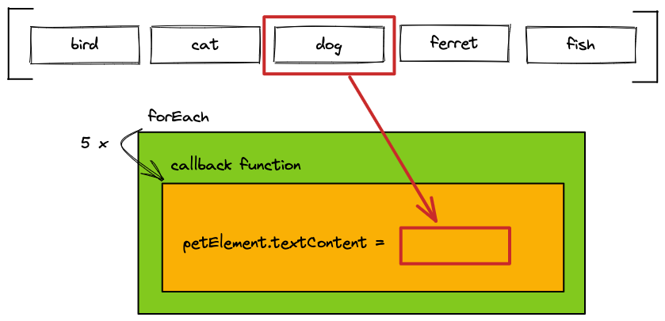

# JS Array Methods

## Learning Objectives

- Understanding array iteration with `forEach`
- Understanding array iteration with `map`
- Knowing the difference between `forEach` and `map`
- Using `filter` to exclude array elements
- Using `document.querySelectorAll`
- [ ] `includes`
- [ ] `find` and `findIndex`
- [ ] `toSorted` and `toReversed`
- [ ] `some` and `every`
- [ ] `reduce`

---

## Introduction to array methods

All array methods presented here have a lot in common and can be used in the same way.

- You provide a callback function with one parameter
- The array method iterates over an array
- The provided callback function gets called for each element in the array
- With each call to the function the current array element gets passed as first argument

This way you can write code and apply it to each element within an array

---

## `forEach`

The array method `forEach` executes some logic for each element within an array.

```js
const pets = ["bird", "cat", "dog", "ferret", "fish"];
pets.forEach((pet) => {
  const petElement = document.createElement("p");
  petElement.textContent = pet;
  document.body.append(petElement);
});
```

> ❗️ The callback function provided to `forEach` **must not** use a `return` statement. `forEach` >
> **does not return** a new array.

> ❗️ You **should** use `forEach` to use a side-effect, like `document.createElement`



---

## `map`

The array method `map` is used to apply a transformation to each element of an array.

The transformed elements are stored in the **newly created array** returned by `map`. The elements
in the original array are not being altered.

You can define the kind of transformation applied to each element in the callback function and
**return** the transformed element.

The created and the original array have the same length.

```js
const pets = ["bird", "cat", "dog", "ferret", "fish"];
const uppercasePets = pets.map((pet) => {
  return pet.toUpperCase();
});
console.log(uppercasePets); // ['BIRD', 'CAT', 'DOG', 'FERRET', 'FISH']
```


> ❗️ The callback function provided to `map` **must** use a `return` statement to return a
> transformed element. `map` **returns** a new array.

> ❗️ You **should not** use `map` to trigger a side-effect, like `document.createElement`

---

## `filter`

The array method `filter` is used to **create a new array** with a subset of the elements of the
original array.

The callback function **returns** a **boolean value** to define, if an element is being included in
the resulting array or not. The original array is not being altered.

The created array is likely to have a shorter length than the original array.

```js
const pets = ["bird", "cat", "dog", "ferret", "fish"];
const petsWithF = pets.filter((pet) => {
  return pet.startsWith("f");
});
console.log(petsWithF); // ['ferret', 'fish']
```

> ❗️ The callback function provided to `filter` **must** use a `return` statement to return a
> boolean value.


---

## Chaining array methods

Often times you need to combine multiple array methods to achieve a desired result. Array methods
like `map` and `filter`, that return a new array, can be **chained**. Instead of storing each array
in a separated variable, the methods can be called directly after another. This reduces the amount
of code and improves readable.

```js
const pets = ["bird", "cat", "dog", "ferret", "fish"];
const uppercasePetsWithF = pets
  .filter((pet) => {
    return pet.startsWith("f");
  })
  .map((pet) => {
    return pet.toUpperCase();
  });
console.log(uppercasePetsWithF); // ['FERRET', 'FISH']
```

---

## `document.querySelectorAll`

With `document.querySelectorAll` you can select a list of elements from the DOM. This is in contrast
to `document.querySelector`, which provides only the first occurrence of an element matching the
selector.

```js
const pets = document.querySelectorAll('[data-js="pet"]');
console.log(pets.length); // 5
```

The `NodeList` returned by `document.querySelectorAll` is an array-like object. You can use the
`forEach` method to iterate over the DOM elements.

```js
const pets = document.querySelectorAll('[data-js="pet"]');
pets.forEach((pet) => {
  pet.addEventListener("click", () => {
    // [...]
  });
});
```

> ❗️ A `NodeList` is not an array! Other array methods like `map` or `filter` can't be used. If you
> need to use array methods, you can convert the `NodeList` to an array using `Array.from()`

---

## `includes`

Use `array.includes()` to check whether the array contains the specified value. If it does, `true`
is returned, otherwise `false`.

```js
const colors = ["hotpink", "aquamarine", "granite"];

colors.includes("aquamarine"); // true
colors.includes("nemo"); // false
```

---

## `find` and `findIndex`

Use `find()` to receive **the first element** of the array that satisfies the provided testing
function. Otherwise, it returns `undefined`.

```js
const colors = ["hotpink", "aquamarine", "granite", "grey"];

colors.find((color) => color.startsWith("g")); // 'granite'
colors.find((color) => color.startsWith("b")); // undefined
```

Use `findIndex()` to receive the index **of the first element** of the array that satisfies the
provided testing function. If there is no such element, `-1` is returned.

```js
const colors = ["hotpink", "aquamarine", "granite", "grey"];

colors.findIndex((color) => color.startsWith("g")); // 2
colors.findIndex((color) => color.startsWith("b")); // -1
```

---

## `toSorted` and `toReversed`

> ❗️ You will find the array methods `sort()` and `reverse()` in the mdn docs. These methods mutate the original array which is bad.
> That is why we use `toSorted()` and `toReversed()` instead. These methods don't mutate the original array and only return the
> sorted or reversed array that can be stored in a new variable.

> ❗️ `toSorted` and `toReversed` are a quite recent additions to the [ECMAScript standards](https://ecma-international.org/). Please make sure to use `Node.js` version 20 or higher when working with these methods.

Use `toSorted()` to sort the elements of an array. You need to provide a callback function in order to
tell how the array is sorted.

### Sorting Numbers

```js
const numbers = [4, 42, 23, 1];

numbers.toSorted((a, b) => a - b); // [1, 4, 23, 42]
numbers.toSorted((a, b) => b - a); // [42, 23, 4, 1]
```

The sorted order is based on the return value of `a - b` / `b - a` :

| Return value of `a - b` | sort order                         |
| ----------------------- | ---------------------------------- |
| > 0                     | sort `a` after `b`                 |
| < 0                     | sort `a` before `b`                |
| === 0                   | keep original order of `a` and `b` |

> 💡 `toSorted()` converts the elements into strings, then compares their sequences of UTF-16 Code units
> values. This is why `array.toSorted()` without a callback is mostly useless.

### Sorting Strings

In order to sort strings, you need to tell the `toSorted()` method two things inside of the callback
function:

- lowercase both strings before comparing them (uppercase works as well)
- using if-statements, be explicit about the return values dependent on the result of the comparison
  (`nameA < nameB` and `nameA > nameB`)

```js
const strings = ["Xbox", "PlayStation", "GameBoy"];

strings.toSorted((a, b) => {
  const nameA = a.toLowerCase();
  const nameB = b.toLowerCase();
  if (nameA < nameB) {
    return -1;
  }
  if (nameA > nameB) {
    return 1;
  }
  return 0;
});

console.log(strings); // ['GameBoy', 'PlayStation', 'Xbox']
```

> 💡 In UTF-16, the upper- and lowercase version of the same letter do not have the same value. An
> uppercase 'H' has the UTF-16 decimal value of 72, while the lowercase 'h' has a value of 104.
>
> For example, an uppercase 'W' (87) and a lowercase 'd' (100) are sorted behind the uppercase 'H'
> (72), but before the lowercase 'h' (104); the result would look like ['H', 'W', 'd', 'h']. This is
> why it's necessary to upper- or lowercase all letters before sorting them.

### `toReversed`

In order to reverse an array, simply use `array.toReversed()`. This can be combined with `toSorted()` as
well:

```js
const numbers = [4, 42, 23, 1];

const reversedNumbers = numbers.toReversed(); // [1, 23, 42, 4]
```

## `some` and `every`

Use `some()` to test whether **at least one element** in the array passes the provided test.

```js
const colors = ["hotpink", "aquamarine", "granite"];

colors.some((color) => color.startsWith("g")); // true
colors.some((color) => color.startsWith("i")); // false
```

In order to check if **all elements** pass the test, use `every()`.

```js
const colors = ["hotpink", "aquamarine", "granite"];

colors.every((color) => color.length > 5); // true
colors.every((color) => color.length < 3); // false
```

---

## `reduce`

`Array.reduce()` is an array method to reduce a list of values into a single value.

It has the following core features:

- starting from the beginning, it executes the callback function on each element of the array,
- the return value of each calculation is passed to the next calculation (i.e. it becomes the new
  starting value for the next iteration through the array)
- the final result is a single value.

It's main use case is to calculate the sum of an array of numbers.

```js
const numbers = [4, 42, 23, 1];

const sum = numbers.reduce((a, b) => a + b);

console.log(sum); // 70
```

> ❗️ If you find yourself doing anything more complex than this with reduce (like reducing an array
> to an object, etc.) you should try to find another solution to your problem. Complex reduce
> functions are very hard to read and thus error prone.
>
> Example of reducing an array to an object without `reduce()`:
>
> ```js
> const myArray = [
>   { foo: 1, bar: "hi" },
>   { foo: 4, bar: "hey" },
>   { foo: 2, bar: "ho" },
> ];
> const myObject = {};
> myArray.forEach((element) => {
>   myObject[element.bar] = element.foo;
> });
>
> console.log(myObject); // {hi: 1, hey: 4, ho: 2}
> ```

---

## Resources

- [MDN web docs: Array forEach](https://developer.mozilla.org/en-US/docs/Web/JavaScript/Reference/Global_Objects/Array/forEach)
- [MDN web docs: Array map](https://developer.mozilla.org/en-US/docs/Web/JavaScript/Reference/Global_Objects/Array/map)
- [MDN web docs: Array filter](https://developer.mozilla.org/en-US/docs/Web/JavaScript/Reference/Global_Objects/Array/filter)
- [MDN web docs: NodeList](https://developer.mozilla.org/en-US/docs/Web/API/NodeList)
- [Searching Arrays (javascript.info)](https://javascript.info/array-methods#searching-in-array)
- [toSorted (mdn)](https://developer.mozilla.org/en-US/docs/Web/JavaScript/Reference/Global_Objects/Array/toSorted)
- [reduce (javascript.info)](https://javascript.info/array-methods#reduce-reduceright)
- [ECMAScript Standards](https://ecma-international.org/)
