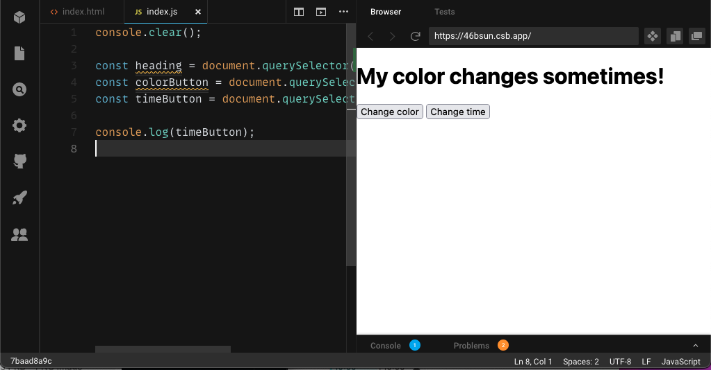
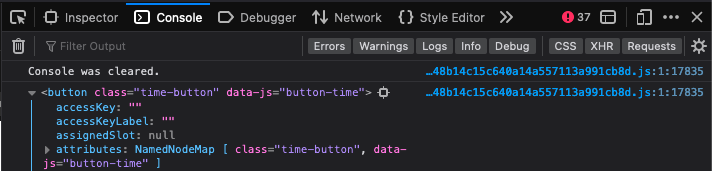

# JavaScript Basics

## Learning Objectives

In this session you will learn:

- [ ] what JavaScript is and does in comparison to HTML and CSS
- [ ] how to integrate JavaScript with `<script>`
- [ ] how you select an element wih `querySelector`
- [ ] how to add, remove and toggle CSS classes on `click` with `addEventListener`
- [ ] what the console is and how to work with `console.log()` and `console.clear()`

---

## Introduction

[Some introduction goes here].

## Connect a JavaScript file

Let us bring some interaction to our website! In order to do this, we create an `index.js` file at
the root of our project. Now, we need to link it with the `index.html` by adding a `script` tag to
the head of the `index.html`:

```
<head>
	...
	<script src="./index.js" defer></script>
</head>
```

The `script` tag has two attributes: `src="./index.js"` contains the relative path to the `index.js`
file. The `defer` attribute tells the browser to delay the loading of the script until all HTML
elements are loaded. Otherwise, the JavaScript we write would not work.

> 💡 Alternative: You can also put the `script` tag after the body element; if doing so, the `defer`
> attribute is not necessary.

## Grabbing HTML Elements: `.querySelector()`

In order to add some interaction to our website, we first need to make the relevant HTML element
available for JavaScript. Have a look at the following example:

```
<body>
	<h1>My color changes sometimes!</h1>
	<button>Change color</button>
</body>
```

We want the color of the `h1` to change if we click on the button. The first step is to grab the
`h1` and the `button` element inside of our `index.js`:

```
const heading = document.querySelector('h1');
const button = document.querySelector('button');
```

To put it short: We create two constants (`const`) with the name `heading` and `button`. Their
content is the entire HTML element, i.e. the `h1` and the `button`, respectively.

Let's have a closer look and start on the right side of the equals sign:

We use the global `document` object which represents the entire web page and its content. This
object provides us with a method called `querySelector`. Note that we make use of this method by
adding it with a `.` after `document`. Within the brackets `()` after `querySelector`, we hand over
a search term in quotation marks. This search term equals the HTML element's name used in the
`index.html` above.

> 💡 Quotation marks represent the type string. We will cover strings in a later session.

So, `document.querySelector('h1')` finds the entire `h1` element (we will further explore what this
means in the next chapter [Check your JavaScript](#check-your-javascript-consolelog)). On the left
side of the equals sign, we save this `h1` element in a constant with the name `heading`. By doing
so, the `h1` element becomes available in our JavaScript file.

### More specific queries are better

Up to now, we used the HTML element name (e.g. `button`) for querying. In most cases, this is not
useful, because ``querySelector` only finds **the first element** in your file. If you have multiple
buttons and want to find the third one, this will not work.

Luckily, you can search for attributes of HTML elements as well. Consider the following code:

```
<button>Change color</button>
<button class="time-button" data-js="button-time">Change time</button>
```

If we want to find the second button, we can use this code:

```
const timeButton = document.querySelector('[data-js="button-time"]');
```

We search for an attribute via square brackets `[]`. We use a
[custom data-js attribute](https://developer.mozilla.org/en-US/docs/Web/HTML/Global_attributes/data-*)
with the value `button-time` to find the second button.

> 💡 We could also search for the class attribute via `.querySelector('[data-js="time-button"]')`.
> However, it is a better practice to separate CSS and JS: use the `class` attribute for CSS and a
> `data-js` attribute for JS.

## Check your JavaScript: `.console.log()`

Every browser has a debugging console. We can use JavaScript and log something to the console. Most
often, we use this to check whether our code has the correct value at a specific point.

To log something to the console, we use the globally available `console` object and its `.log()`
method. If we want to check whether the query for our `timeButton` was successful, we need to add
this code **below our query**:

```
const timeButton = document.querySelector('[data-js="button-time"]');
console.log(timeButton);
```

We need to open the console first:

- in Firefox, use <kbd>Cmd</kbd> + <kbd>Option</kbd> + <kbd>K</kbd>
- in Chrome, use <kbd>F12</kbd> or the shortcut <kbd>Cmd</kbd> + <kbd>Option</kbd> + <kbd>J</kbd>
- in a Codesandbox, you find the console at the bottom of your Browser's tab (note the blue "1"
  right next to the word "Console"): 

Now, we can see the following output in the console:

```
<button class="time-button" data-js="button-time">Change time</button>
```

Congratulations, you have grabbed your first HTML element to use it in a JavaScript file! 🎉 As
mentioned above, the `querySelector` returns **the entire element** with both attributes `class` and
`data-js`. We will use this to add interaction in the next chapter!

> 💡 If you open the console in the browser (instead of Codesandbox), you will have a small arrow
> next to the button output. If you click on this arrow, you will see a long list of all properties
> which are also available. 
> These "hidden" properties are the reason why we can do magic with JavaScript!

### Useful Addition: `console.clear()`

Have you noticed the `console.clear()` in the first line of the Codesandbox example above? This
method clears the console, i.e. all outputs before this line are deleted.

When put at the beginning of a file, you can be sure the console is cleared every time you reload
the page. This is very useful when you practice JavaScript, because all "older" outputs are deleted.
You can be sure to only see the **output of your current code** - so be focussed by using
`console.clear()`!

## Add Interaction: `.addEventListener()`

- Define `events`
- Explain `addEventListener`
- Show in Codepen an example where you use a `click event` with `addEventListener`:
  - Start with `console.log('click')`
  - Introduce `classList` with `add()`, `remove()` and `toggle()`

---

# Challenges

## Part 1

## Part 2

---

## Resources
