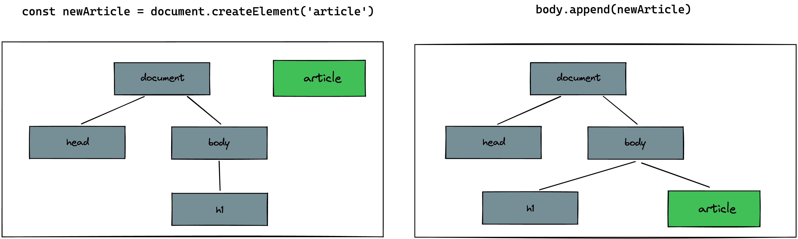

# JS createElement

> 💡 feel free to create a personal branch of this guide to add your own notes

## Learning objectives

- [ ] learning how to generate HTML in JavaScript
- [ ] using HTML element object properties and methods
- [ ] how to use .innerHTML

---

## Arrival: Motivate students and prepare them for today's topic(s)

> 💡 Breathe and relax :)

### Which important problem will we solve today?

How to generate parts of your HTML code with JavaScript. How to automatically create similar
elements like posts from our data.

### Pose a question to be answered by the end of the block!

How can we write JavaScript code that generates parts of our webpage for us?

---

## Activate prior knowledge of students

### Which previously learned concepts will be utilized in this session?

- DOM representations of HTML elements
- classList and eventListeners

---

## Inform: Session Guide

### createElement and append

- [ ] Show why we want to generate HTML from JavaScript:
  - [ ] open a website with similar posts like reddit or twitter
  - [ ] highlight, that these elements are generated automatically from data
  - [ ] show that we need to learn how to do this to build a modern web app
- [ ] create a simple **article** element in the dom
  - [ ] `const newArticle = document.createElement('article')`
  - [ ] sketch the following diagram in excalidraw:
        
- [ ] explain that additionally to create an Element you have to **place it** somewhere in the DOM
      tree.
  - [ ] `body.append(newArticle)`
  - [ ] show the effect in your example webpage
  - [ ] explain that append puts the element as the **last child** in the respective element

### Section 2

- [ ]
- [ ]

---

## Process: Challenges

- [ ] Provide the [handout](js-createelement.md) and the
      [challenges](challenges-js-createelement.md) to the students
- [ ] Open the handout and walk the students through the tasks
- [ ] Divide the students into groups of \_\_\_
- [ ] Remind them of the ground rules:
  - meet again 30 min before lunch break in the class room
  - they can ask the coaches for help at any time
  - always try to help each other
  - take a break within the next 1.5 hrs
  - keep an eye on Slack

---

## Evaluate: Recap of the assignment / Discussion of the MVP / Solution

- Revisit the question that was posed in the beginning of the session and try to answer it with a
  few phrases.

---

## Checkout

> 💡 In case the students seem frustrated try to find some encouraging words (e.g. remind them of
> how far they have come already) :)

- [ ] Summarize the day by repeating all of the topics that were discussed
- [ ] Highlight the progress made that day
- [ ] Encourage the students to repeat what they learned with practical exercises
- [ ] Remind them to rest :)

## Keywords for Recap:

> These keywords are for the weekly summary on Fridays. We use the keywords to automatically
> generate excalidraw tags with the help of
> [this amazing tool](https://github.com/F-Kirchhoff/tag-cloud-generator). The students structure
> the cards in a pattern that makes sense for them. Each tag, that is added to the structure needs
> to be explained in a few words by one student. We go in rounds one by one until all tags are
> included in the structure.
