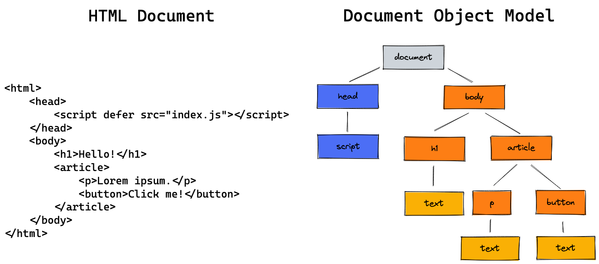
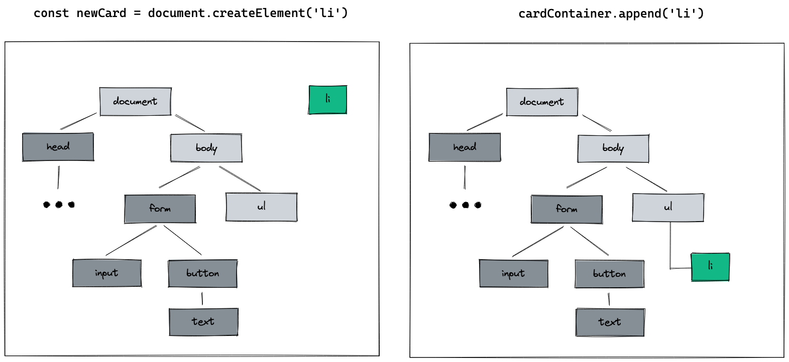

# JS createElement

> 💡 feel free to create a personal branch of this guide to add your own notes

| duration | content         |
| -------- | --------------- |
| 0:45     | Session         |
| 1:30     | Active Learning |
| 0:30     | Recap           |

## Learning objectives

- [ ] knowing what the DOM is
- [ ] learning how to generate HTML in JavaScript
- [ ] using HTML element object properties and methods
- [ ] learning how to use `.innerHTML`

---

## Arrival: Motivate students and prepare them for today's topic(s)

> 💡 Breathe and relax :)

### Which important problem will we solve today?

- how to generate parts of your HTML code with JavaScript
- how to automatically create similar elements like posts from our data

### Pose a question to be answered by the end of the block!

How can we write JavaScript code that generates parts of our webpage for us?

---

## Activate prior knowledge of students

### Which previously learned concepts will be utilized in this session?

- querySelector
- classList and eventListeners
- JS forms

---

## Inform: Session Guide

### Motivation

- [ ] show why we want to generate HTML from JavaScript:
- [ ] open a website with similar posts like reddit or twitter
- [ ] highlight that these elements are generated automatically from data
- [ ] show that we need to learn how to do this to build a modern web app
- [ ] During the session, show an example of how to generate HTML by creating a card component from
      a simple form. You can use this demo:
  - starter code:
    [codesandbox](https://codesandbox.io/s/github/neuefische/web-exercises/tree/main/sessions/js-createelement/demo-start?file=/js/index.js)
  - final code:
    [codesandbox](https://codesandbox.io/s/github/neuefische/web-exercises/tree/main/sessions/js-createelement/demo-end?file=/js/index.js)

### The DOM

- [ ] explain, that JavaScript can access and change the HTML document via the **DOM**
- [ ] **Document Object Model**: A data representation of the HTML website. Each tag is modelled as
      a **node** in the document tree.
- [ ] access the DOM via the `document` object, e.g. `document.querySelector`
- [ ] sketch a quick DOM representation of the demo HTML 

### `document.createElement` and `.append`

- [ ] create a simple **li** element in the DOM
  - [ ] `const newCard = document.createElement('li')`
  - [ ] extend the diagram in excalidraw: 
- [ ] explain that in addition to creating an element you have to **place it** somewhere in the DOM
      tree: `document.body.append(newCard)`
  - [ ] show the effect in your example webpage
  - [ ] explain that `.append` puts the element as the **last child** in the respective element

### Element Properties and EventListeners

- [ ] highlight that new created elements behave the same way as queried elements
- [ ] show that the element doesn't have to be queried to be manipulated. It is already saved in a
      variable, e.g. `newCard`.
- [ ] quickly recap how to add properties to an element
  ```js
  newCard.classList.add("card");
  newCard.textContent = "This text is displayed in the element";
  ```
- [ ] add this code to an event listener on the form element:
  ```js
  form.addEventListener("submit", (event) => {
    event.preventDefault();
    const newCard = document.createElement("li");
    newCard.classList.add("card");
    newCard.textContent = "This text is displayed in the element";
    cardContainer.append(newCard);
  });
  ```

### `.innerHTML`

- [ ] `.innerHTML`: the given string is parsed to HTML and becomes the content of the element.
- [ ] useful to generate many HTML elements from a single string, e.g.
  ```js
  const cardText = textInput.value;
  newCard.innerHTML = `
  	<h2>Card</h2>
  	<p>${cardText}</p>
  `;
  ```
- [ ] highlight that the previous content of the element is overwritten
- [ ] can be used to clear the content of an element: `newCard.innerHTML = ""`
- [ ] mention, that `.innerHTML` might be dangerous and should not be used with user input

---

## Process: Challenges

- [ ] Provide the [handout](js-createelement.md) and the
      [challenges](challenges-js-createelement.md) to the students
- [ ] Open the handout and walk the students through the tasks
- [ ] Divide the students into groups
- [ ] Remind them of the ground rules:
  - meet again 30 min before lunch break in the class room
  - they can ask the coaches for help at any time
  - always try to help each other
  - take a break within the next 1.5 hrs
  - keep an eye on Slack

---

## Evaluate: Recap of the assignment / Discussion of the MVP / Solution

- Revisit the question that was posed in the beginning of the session and try to answer it with a
  few phrases.

---

## Checkout

> 💡 In case the students seem frustrated try to find some encouraging words (e.g. remind them of
> how far they have come already) :)

- [ ] Summarize the day by repeating all of the topics that were discussed
- [ ] Highlight the progress made that day
- [ ] Encourage the students to repeat what they learned with practical exercises
- [ ] Remind them to rest :)

## Keywords for Recap:

createElement, append, innerHTML, textContent, classList

> These keywords are for the weekly summary on Fridays. We use the keywords to automatically
> generate excalidraw tags with the help of
> [this amazing tool](https://github.com/F-Kirchhoff/tag-cloud-generator). The students structure
> the cards in a pattern that makes sense for them. Each tag, that is added to the structure needs
> to be explained in a few words by one student. We go in rounds one by one until all tags are
> included in the structure.
