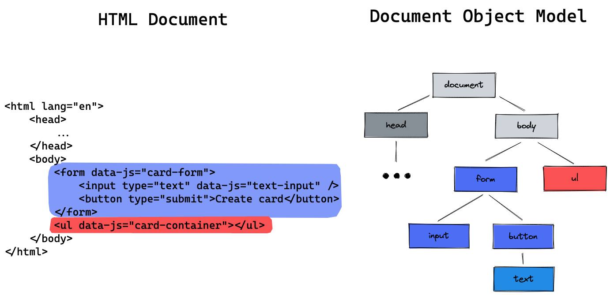

# JS createElement

## Learning objectives

- knowing what the DOM is
- learning how to generate HTML in JavaScript
- using HTML element object properties and methods
- learning how to use `.innerHTML`

---

- how to generate parts of your HTML code with JavaScript
- how to automatically create similar elements like posts from our data

### Question

How can we write JavaScript code that generates parts of our webpage for us?

---

### Required

- querySelector
- classList and eventListeners
- JS forms

---

## Session Guide

### Motivation

- show why we want to generate HTML from JavaScript:
- open a website with similar posts like reddit or twitter
- highlight that these elements are generated automatically from data
- show that we need to learn how to do this to build a modern web app
- During the session, show an example of how to generate HTML by creating a card component from
  a simple form. You can use this demo:

Demo Start:

```
npx ghcd@latest neuefische/web-exercises/tree/main/sessions/js-createelement/demo-start
```

Demo End:

```
npx ghcd@latest neuefische/web-exercises/tree/main/sessions/js-createelement/demo-end
```

### The DOM

- explain, that JavaScript can access and change the HTML document via the **DOM**
- **Document Object Model**: A data representation of the HTML website. Each tag is modelled as
  a **node** in the document tree.
- access the DOM via the `document` object, e.g. `document.querySelector`
- sketch a quick DOM representation of the demo HTML 

### `document.createElement` and `.append`

- create a simple **li** element in the DOM
  - `const newCard = document.createElement('li')`
  - extend the diagram in excalidraw: 
- explain that in addition to creating an element you have to **place it** somewhere in the DOM
  tree: `document.body.append(newCard)`
  - show the effect in your example webpage
  - explain that `.append` puts the element as the **last child** in the respective element

### Element Properties and EventListeners

- highlight that new created elements behave the same way as queried elements
- show that the element doesn't have to be queried to be manipulated. It is already saved in a
  variable, e.g. `newCard`.
- quickly recap how to add properties to an element

  ```js
  newCard.classList.add("card");
  newCard.textContent = "This text is displayed in the element";
  ```

- add this code to an event listener on the form element:
  ```js
  form.addEventListener("submit", (event) => {
    event.preventDefault();
    const newCard = document.createElement("li");
    newCard.classList.add("card");
    newCard.textContent = "This text is displayed in the element";
    cardContainer.append(newCard);
  });
  ```

### `.innerHTML`

- `.innerHTML`: the given string is parsed to HTML and becomes the content of the element.
- useful to generate many HTML elements from a single string, e.g.
  ```js
  const cardText = textInput.value;
  newCard.innerHTML = `
  	<h2>Card</h2>
  	<p>${cardText}</p>
  `;
  ```
- highlight that the previous content of the element is overwritten
- can be used to clear the content of an element: `newCard.innerHTML = ""`
- mention, that `.innerHTML` might be dangerous and should not be used with user input

---
