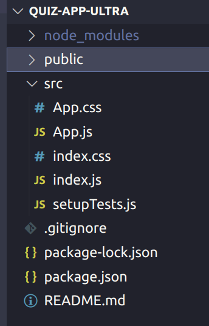
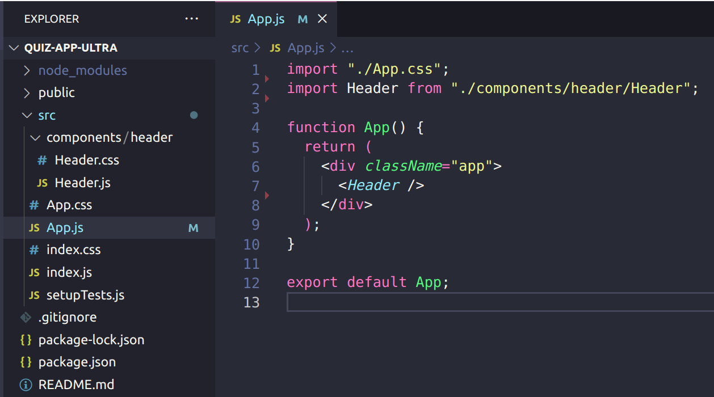
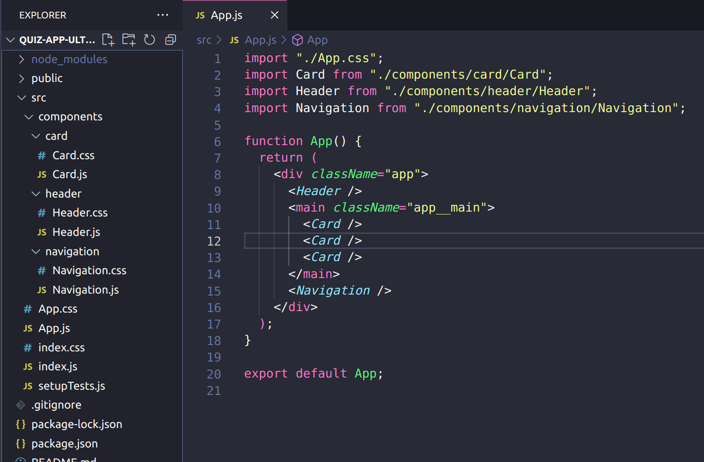

# Challenges: React Basics - Quiz App Ultra

In these challenges you will rebuild the layout of the quiz app without any functionality. We will
add the functionality later. Your app will have:

- A static header
- A static navigation bar that indicates you are on the home page
- A couple of static and identical cards

❗️ Even though the app will have a navigation bar, it will be completely static. If the user clicks
on the navigation nothing will happen and no page change will happen.

## 1. Setup

- Set up a new React App using `npx create-react-app quiz-app-ultra`.
- Create a remote repository and connect it to the local repository of the app.
- Change the document title to: "Quiz App Ultra".
- Clean up the app. You can delete all content in the App.js and just have it return an empty div.
  Also remove unnecessary files. Your file structure can look like this afterwards:

  

## Header Component

- Create a component folder and a subfolder for your header component.
- Create files for your component (.js and .css).
- Write the JSX for your component and have it return a simple header with an h1 saying: "Quiz App
  Ultra"
- Write the styles for your component and make sure the css file is imported in your js file.
- Use the new component in your App. Your App source code could look like this:

## Navigation and Cards

- Create more components so your app will have a static navigation and some static cards. Your App
  source code could look like this afterwards:

