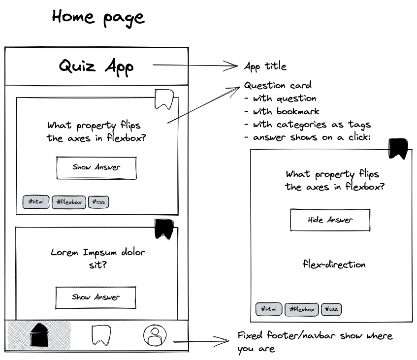
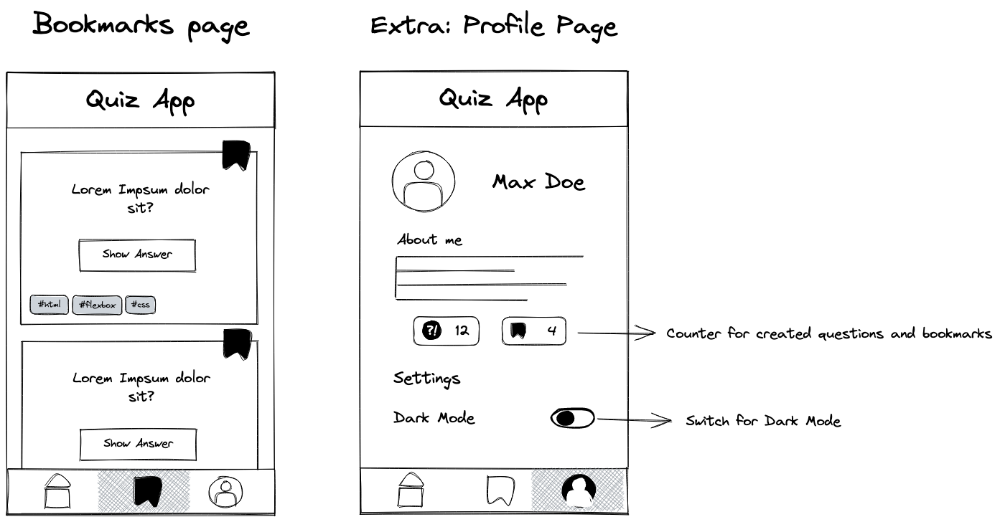

# Recap I: Quiz App - Layout

In this project you will build the layout of your first mobile web application, a quiz app. In later
projects we will expand this app and add all sorts of cool functionality. In this app you will be
able to:

- Read questions and click a button to look up the answers.
- Bookmark questions and collect them on a bookmarks page.
- Visit your profile page.

❗️ You don't have to worry about how to toggle the answer view or bookmarks, we will work on that
in a later project. But make sure you include the answer texts and bookmark buttons to your app.
(You might want to look up the "hidden" attribute)

## 1. Setup

Start by:

- Creating a new folder for your project.
- Initialize a local git repository.
- Create a remote repository and connect it to the local repository.
- Create the index.html and styles.css files.
- Make sure the CSS file is loaded in the HTML document.
## 2. Home Page

As you already know from the previous project, as developers we want to always finish a feature and
add it to our main branch, instead of starting 3 different pages and none of them work. This is why
the first step to success is to start with the homepage.

- Create the following layout:

- Start with the feature 'title' on a fresh feature branch and create the app title.

- When done, use the feature branch workflow to merge your results into the main branch.
- Continue in the same way with the 'question-card' and 'navbar'.

> 💡 Hint: Make sure to use anchor elements for the navbar elements, so you can link to the other
> pages later on!

> 💡 Hint: You can ask coaches and fellow students to review your PRs. You can learn and improve a
> lot by doing so.

## 3. Bookmarks Page

The second page is the bookmarks page.

- Create a new file called 'bookmarks.html'.
- Add the content to the page. You can copy the content of the index.html to save time.
- Make sure that only bookmarked questions are on this page.
- Update the Navbar so that the bookmark icon is highlighted.
- Link the two pages inside the anchor elements. (Also in the home page).

## Extra: Profile Page

Create the Profile Page in the same way you created the other two pages.

- Create a new file `profile.html`.
- Add the content to the page.
- Link the pages via the anchor tags.

> 💡 The counter and switch don't have to work for now, we will implement this later.
