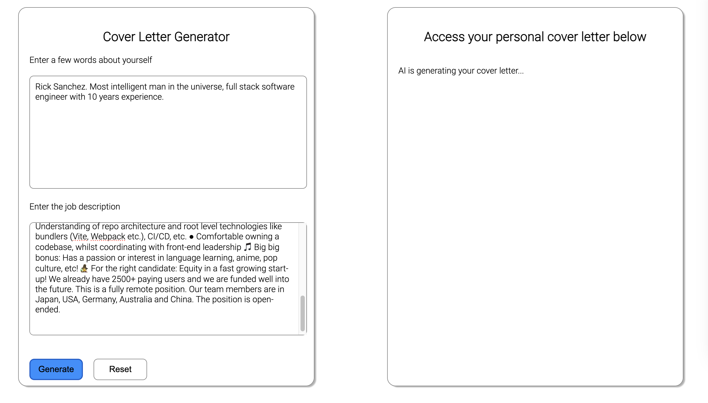

# Challenges - Self Directed Learning 7

## AI Cover Letter Generator

Let's use our knowledge of next.js + api routes to build an AI Cover Letter Generator.



We can create a new project from the following template

```
npx ghcd@latest neuefische/web-exercises/tree/main/templates/next cover-letter-generator -i
```

We will use the [OpenAI Node API Library](https://www.npmjs.com/package/openai)

```bash
npm install openai
```

We have 2 options for this project.

1. Use the [openai API](https://platform.openai.com/api-keys). Yuo can either sign up and add a credit card and pre-pay for some credits (min $5.95 incl. taxes at the time of writing) 💰 or you can reach out to a coach and get credentials from us. It is important we don't expose the API key from openai. [See more on this here](./assets/openai-api-key-setup.md).
2. Alternatively you can use [LM Studio](https://lmstudio.ai/) to run an open source model locally. (free). You can follow our [guide here to get things setup](./assets/lm-studio-setup.md)

### 🙈 Hints 🙈

<details>
<summary>Client side (i.e. index.js) 🙈</summary>

- Form (with 2 textareas)
- useState to display the end result (initial value empty)
- Event Listener for submit
- Inside `handleSubmit` we will need to make a request to our API route (i.e. `/api/generate`)
</details>

<details>

<summary>Server Side (i.e. api routes) 🙈</summary>

- `/api/generate.js`
- `import OpenAI from "openai";`
- If you are using your own openai api key you will need something like this.
  ```js
  const openai = new OpenAI({
    apiKey: process.env.OPEN_API_KEY,
  });
  ```
- If you are using LM Studio, you would need something like this. (Double check the port)
  ```js
  const openai = new OpenAI({
    baseURL: "http://localhost:1234/v1",
    apiKey: "lm-studio",
  });
  ```
- Read the user and company info from the body and use it to generate a prompt. i.e. something like

```js
const prompt = `Write a cover letter for a job application. Some info about the company and the position: ${companyInfo}. Some info about myself: ${userInfo}.`;
```

- Make a request using the openai package. i.e.

```js
const response = await openai.chat.completions.create({
  messages: [{ role: "user", content: prompt }],
  // model: "gpt-3.5-turbo", // use this if using your own openai key
});
```

- Find the relevant data in the response and send it back to the client. Please note that it might take a while to generate the response if you are running it locally.
</details>

<details>
<summary>Example Finished Code for index.js 🙈🙈</summary>

```js
import { useState } from "react";

export default function Home() {
  const [apiOutput, setApiOutput] = useState("");

  const callGenerateEndpoint = async (userInfo, companyInfo) => {
    setApiOutput("AI is generating your cover letter...");

    const response = await fetch("/api/generate", {
      method: "POST",
      headers: {
        "Content-Type": "application/json",
      },
      body: JSON.stringify({ userInfo, companyInfo }),
    });

    const data = await response.json();
    console.log(data);
    const { output } = data;
    console.log("OpenAI replied...", output);

    setApiOutput(output);
  };

  const handleSubmit = (event) => {
    event.preventDefault();
    const formElements = event.target.elements;
    const userInfo = formElements.userInfo.value;
    const companyInfo = formElements.companyInfo.value;
    callGenerateEndpoint(userInfo, companyInfo);
  };

  return (
    <div>
      <section>
        <div>
          <h1>Cover Letter Generator</h1>
        </div>
        <div>
          <form onSubmit={handleSubmit}>
            <div>
              <label htmlFor="userInfo">Enter a few words about yourself</label>
            </div>
            <textarea id="userInfo" name="userInfo" rows="10" />
            <div>
              <label htmlFor="companyInfo">Enter the job description</label>
            </div>
            <textarea id="companyInfo" name="companyInfo" rows="10" />
            <div>
              <button className="generate-button" type="submit">
                Generate
              </button>
              <button type="reset">Reset</button>
            </div>
          </form>
        </div>
      </section>
      <section>
        <h1>Access your personal cover letter below</h1>
        <p>{apiOutput}</p>
      </section>
    </div>
  );
}
```

</details>

<details>
<summary>Example Finished Code for /api/generate.js 🙈🙈</summary>

```js
import OpenAI from "openai";

// const openai = new OpenAI({
//   apiKey: process.env.OPEN_API_KEY,
// });
const openai = new OpenAI({
  baseURL: "http://localhost:1234/v1",
  apiKey: "lm-studio",
});

export default async function handler(request, response) {
  console.log(request.body);
  const { userInfo, companyInfo } = request.body;

  const prompt = `
  Write a cover letter for a job application. Some info about the company and the position: ${companyInfo}. Some info about myself: ${userInfo}. 
  `;

  const data = await openai.chat.completions.create({
    messages: [{ role: "user", content: prompt }],
    // model: "gpt-3.5-turbo", // use this if using your own openai key
  });

  const completion = data.choices[0].message.content;

  response.status(200).json({ output: completion });
}
```

</details>

### Sample Data

Here is some sample date for you to copy and paste while developing.

<details>
<summary>Sample User Description</summary>
Rick Sanchez. Most intelligent man in the universe, full stack software engineer with 10 years experience.
</details>

<details>
<summary>Sample Job Add</summary>
Remote Senior Front End Developer. Join our fun and international team, benefit from a flexible work environment and work on products that help people across the world understand each other. We welcome candidates from all cultures, genders, or walks of life 💛🌐💚 Migaku is an all-in-one language learning platform that allows you to study a language with content you love on Netflix, Youtube, websites, books, and more. Create flashcards with one click while you watch or read, including a screenshot and audio recording of the scene, and study them on your phone later wherever you are. We're going through a big rebranding and we’re now looking for a senior front-end developer to help build apps based on our new, super fun brand and UI designs. The ideal candidate... 💬 Is fluent in English ⏱ Can start immediately 🏝 Wants to work remotely 👀 Has a keen eye for details 🖥 Has experience with: ● Vue, ideally Vue 3 and Composition API ● Strong React developers are also welcome, but you should be comfortable with a switch to Vue ● Experience in frameworks like Nuxt.js or Next.js and knowledge of different rendering techniques like SSG, SSR, ISR. Bonus for interest in emerging technologies like Astro ● Strong CSS fundamentals ● Understanding of repo architecture and root level technologies like bundlers (Vite, Webpack etc.), CI/CD, etc. ● Comfortable owning a codebase, whilst coordinating with front-end leadership 🎵 Big big bonus: Has a passion or interest in language learning, anime, pop culture, etc! 🧙‍♀️ For the right candidate: Equity in a fast growing start-up! We already have 2500+ paying users and we are funded well into the future. This is a fully remote position. Our team members are in Japan, USA, Germany, Australia and China. The position is open-ended.
</details>

---

---

---

## Next Structure

Now that we are dealing with a more complex architecture, it's good to take a step back from coding and spend it to have a look at the big picture.

Let's have a look at a basic Next project file structure:

```
db
  models
    User.js
  connect.js
lib
  utils.js
components
  forms
    LoginForm.js
    RegisterForm.js
  UserList.js
  User.js
pages
  api
    users
      index.js
      [id].js
  users
    index.js
    [id].js
  index.js
```

## The `/pages` folder

Files contained in this folder are responsible for the app routing:

| File                        | URL(s)                                                                    |
| --------------------------- | ------------------------------------------------------------------------- |
| `/pages/index.js`           | http://localhost:3000/                                                    |
| `/pages/users/index.js`     | http://localhost:3000/users                                               |
| `/pages/users/[id].js`      | http://localhost:3000/users/1, http://localhost:3000/users/2 ...          |
| `/pages/api/users/index.js` | http://localhost:3000/api/users                                           |
| `/pages/api/users/[id].js`  | http://localhost:3000/api/users/1, http://localhost:3000/api/users/1, ... |

Remember that the Next underlying code is handling the routing for you.

### Note about parametric routes

Files like `/users/[id].js` match multiple URLs like `/users/1`, `/users/2`...
The **parameter** is available inside the file via `next/router`:

```js
import { useRouter } from "next/router";

export default function UserPage() {
  const router = useRouter();
  const { id } = router.query;
  // do something with the id
  // probably to compose the API URL for an useSWR call
}
```

Usually we call the parameter `id` and we reference it in both the filename (`/users/[id].jd`) and the component (`router.query.id`).

Sometimes you may need multiple parameters, e.g. `/products/[productId]/versions/[versionId].jd`. Both will be available in the `router.query`.

### The API files

For `GET` requests, they expose the data as JSON. Remember that you can always manually visit http://localhost:3000/api/users for instance, to check directly if the response is looking like you expect.

For `POST`, `PUT` and `DELETE` requests, you have to intercept the method in the handler:

```js
export default async function handler(request, response) {
  if (request.method === "POST") {
    try {
      const newUser = await User.create(request.body);
      response.status(201).json(newUser);
    } catch (error) {
      console.log("POST /api/users", error);
      response.status(500).json({ message: "Error creating new user" });
    }
    return;
  }

  if (request.method === "GET") {
    // ...
  }
  // ...rest of the handlers
}
```

## The `/components` folder

Here you can organise the React components: forms, lists, single items, etc...with the corresponding styles depending on your styling strategy.

## The `/db` folder

Everything MongoDB related goes here. The `connect.js` file exposes the DB connection, that should be imported in every API route that needs to interact with Mongo.

Every model (`User`, `Service`, `Review`, `Rating`...) belongs in a separate file, where the Mongoose schema is defined:

```js
import mongoose from "mongoose";

const UserSchema = new mongoose.Schema({
  firstName: {
    type: String,
    required: true,
  },
  lastName: {
    type: String,
    required: true,
  },
  email: {
    type: String,
    required: true,
  },
  createdAt: {
    type: Date,
    default: Date.now,
  },
});

const User = mongoose.models.User || mongoose.model("User", UserSchema);

export default User;
```

## The `/lib` folder

Code that is not strictly related to Next, React or MongoDB and that should be shared between different contexts can be put in a separate library folder:

```js
// /lib/utils.js
export function formatDate(timestamp) {
  return new Date(timeStamp).toLocaleDateString();
}

// /components/User.js
import { formatDate } from '../lib/utils.js';

export default function User() {
  // ...
  return (
    <>
      <h1>{user.firstName} {user.lastName}</h1>
      <p>Member since {formatDate(user.createdAt)}<p>
    </>
  );
}
```
