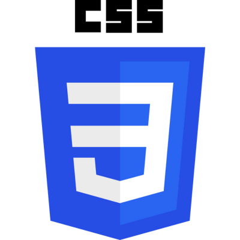
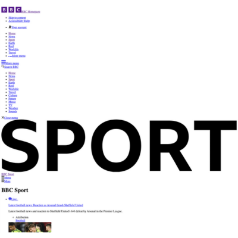
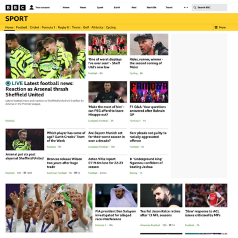
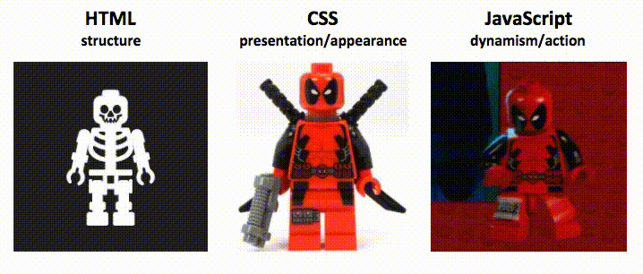
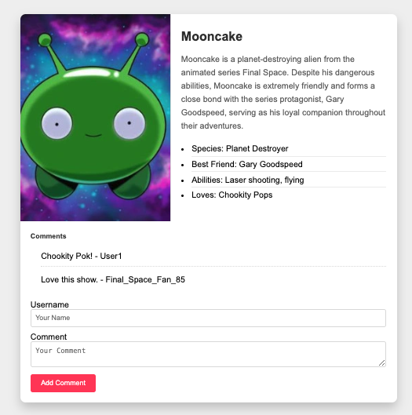
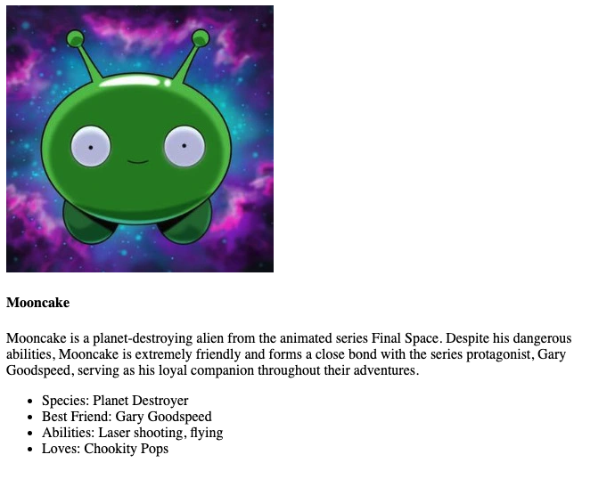
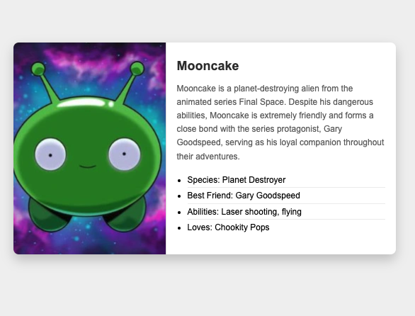

<!-- _class: intro-slide nemo -->

WebDev Day

---

<!-- _class:  small  -->

## Schedule Day 1

- Rough plan for the morning
- Intro (now)
- Code some HTML: 10:15 - 11:00
- Break Time
- Intro to CSS: 11:15 - 11:45
- Code some CSS
- Wrap up / questions: 12:30 - 13:00

---

<!-- _class:  small  -->

## Schedule Day 2

- Introduction to forms and inputs
- Code a hotel booking form: 10:15 - 11:15
- Break Time
- CSS Variables: 11:30 - 12:00
- Coding practice
- Wrap up / questions: 12:30 - 13:00

---

<!-- _class: small -->

## The Birth of the Web

- Tim Berners-Lee worked at CERN
- Problem - information sharing between scientists across the globe

---

<!-- _class: hsplit  -->

## The Backbone of the Web

- Hypertext Markup Language
- Structure content
- i.e. headings, paragraphs, links, lists, images

---

<!-- _class: big-headline -->

[http://info.cern.ch](https://info.cern.ch/)

---

<!-- _class: hsplit  -->

## Styling with CSS

- Cascading Style Sheets
- Make things look great!

---

<!-- _class: hsplit  -->

## Before and after CSS

---

<!-- _class: hsplit  -->

## Bringing Interactivity with JavaScript

- React to user events
- Change what appears on the screen

---

<!-- _class: hsplit   -->

## Let's build something together

- This is the final version
- HTML, CSS and JS

---

<!-- _class: hsplit small   -->

## Version 1 - HTML

- First version is HTML only
- Pick a character for your card (author, celebrity, cartoon character)
- Heading
- Image
- Description
- Bullet Points

---

<!-- _class: hsplit small   -->

## Version 2 - HTML + CSS

- Let's add some styles
- Learn how to inspect the page
- We might need to divide up our content (using `

`)
- What are classes?
- How to add classes to the html, and target them with CSS

---

<!-- _class: intro-slide nemo -->

Questions?
